こんにちは！

今回はGoogle Apps Scriptを使って、Googleフォームに回答が来たら、メールを送信するスクリプトを作ってみます。
<br/>
入門者向けに丁寧に書いていきたいと思います。

まずは適当にフォームを作ってみましょうかね。

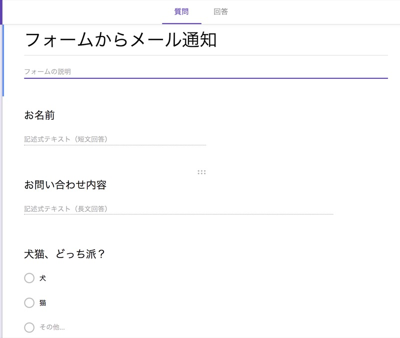

はい、こんな感じで、、、

右上の「・・・」から、「スクリプトエディタ」をクリックして、コードを書いていきましょう。


## フォーム送信時に関数を実行する

### 関数を書いてみる

とりあえずフォーム送信時に実行される関数を作ってみます。

コードの内容を全部消して、以下のように記載してください。

```js
function onFormSubmit(e) {
  Logger.log('フォームが送信されたぞ');
}
```

で、`command+s`で保存してください。

プロジェクトの名前を聞かれたら、フォームに付けた名前と同じのを入力して、OKを押します。

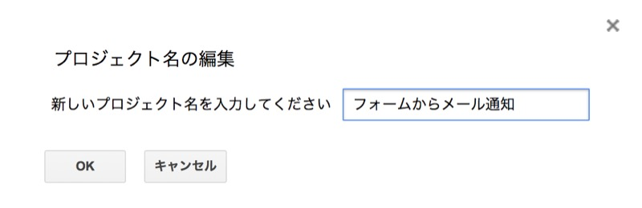

### コードの解説をします

```js
function onFormSubmit(e){
```

のところですが、関数名は何でもいいです。

引数にeを取ってますが、現時点では使わないです。後で使います。

```js
Logger.log('フォームが送信されたぞ');
```

のところですが、

`Logger.log`っていうのは、GASに用意されている
<a href="https://developers.google.com/apps-script/reference/base/logger" target="_blank" rel="noopener noreferrer">Logger</a>
っていうクラスのlogメソッドを実行しているんですが、

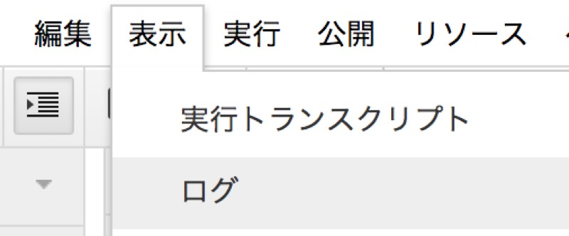

何が起こるかというと、メニューの「表示」→「ログ」を押したときに出る画面に出てくるんですね。

引数に何入れてもなんとなく情報が得られるので、お試しには最適のやつです。

この関数が実行されたら、ログに`フォームが送信されたぞ`と書かれる、っていう単純なスクリプトを書きました。

### トリガーの設定

続いてフォーム送信時のトリガーと関数を関連付ける設定です。

メニューから「編集」→「現在のプロジェクトのトリガー」をクリックします。

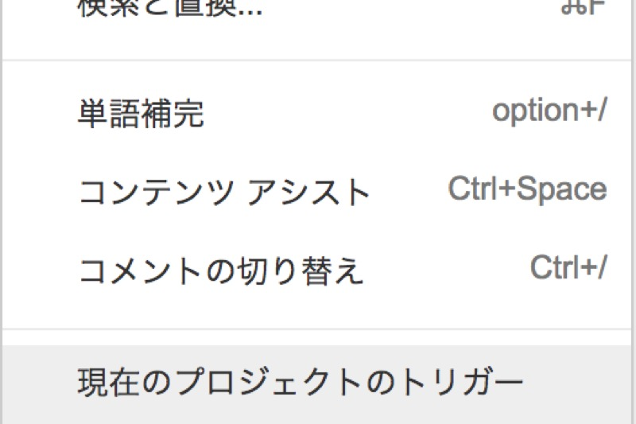

新規タブでトリガー設定画面が出るので、右下にある「トリガーを追加」をクリックします。

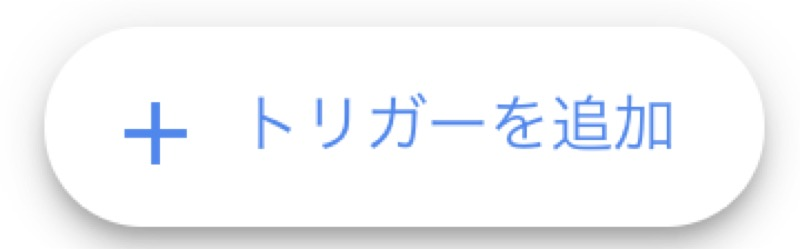

何やら選択項目がいろいろ出てくるのですが、左下の「イベントの種類を選択」を「フォーム送信時」にしてOKを押せばOKです。

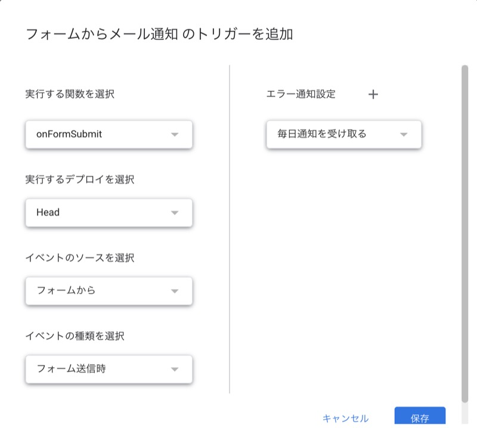

ちなみにそれぞれの項目を説明すると、

「実行する関数を選択」は、コードに書いたfunctionのどれを実行するか選択するものです。
<br/>
今回はonFormSubmitしか書いてないので、それが選択されています。

「実行するデプロイを選択」は、使ったこと無いのですが、多分ソースコードをバージョン管理してたら、どのバージョン使いますか、的なことだと思います。
<br/>
Headを選んどけば問題ないはずです。

ちなみにHeadは「最新だよ！」という意味です。

「イベントのソースを選択」は、「トリガーを実行する元は何か？」を設定します。
<br/>
今回はフォーム送信時のイベントで実行したいので「フォームから」を選択します。

「イベントの種類を選択」では、「『イベントのソース』が何したとき？」を選択します。
<br/>
今回はフォーム送信時のイベントで実行したいので「フォーム送信時」を選択します。

「エラー通知設定」はですね、、スクリプトでエラーが発生した場合にエラー内容をメールで送ってくれる機能ですね。

メールは、トリガーを作成した人のGmailアカウントに送られます。

正直「『通知を受け取らない』は無いんかい！」と思うんですが、今のとこ無いみたいですね。
<br/>
とりあえず「毎日通知を受け取る」にしておいて、メールが来たら「ああ、あれか。」と思うことにしましょう。

### 試しにフォーム回答してみる

設定を保存したらフォームの編集画面に戻って、

「プレビュー」を押して、


適当に入力して送信します。

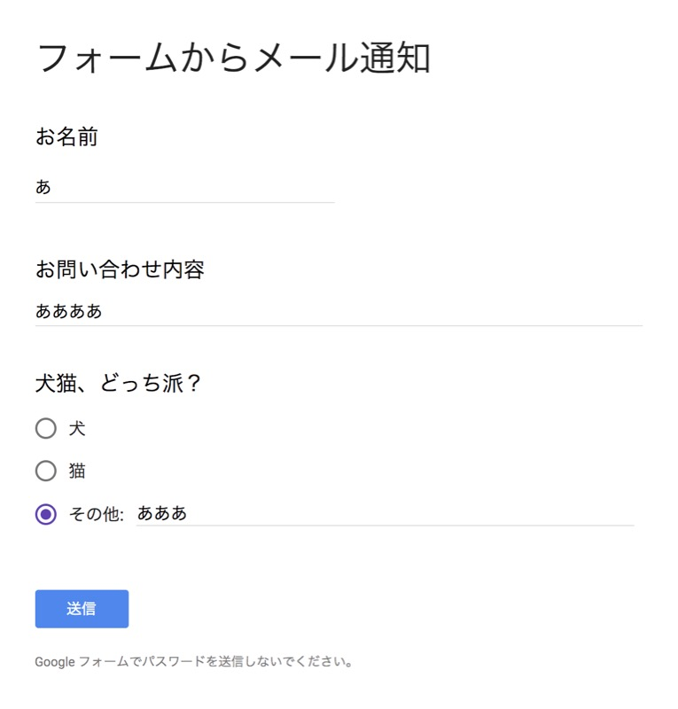

エディタの画面に戻ってメニューの「表示」→「ログ」を押すと、


さっき仕掛けたログが出てますね。

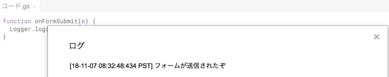

これでフォーム送信時に関数を実行する仕組みはできました。

おめでとうございます。

## GASでメールを送信する

続いてメール送信機能を作っていきましょう。


GASでメールを送信するには、
<a href="https://developers.google.com/apps-script/reference/gmail/gmail-app" target="_blank" rel="noopener noreferrer">GmailApp</a>
というクラスの
<a href="https://developers.google.com/apps-script/reference/gmail/gmail-app#sendEmail(String,String,String)" target="_blank" rel="noopener noreferrer">sendEmail</a>
関数を使います。

使い方は、

```js
GmailApp.sendEmail('your-email@example.com', '件名' ,'本文');
```

という感じです。

変数に値を入れておいて関数の引数に渡してやる形にしてみましょう。

メールアドレスのところはご自身のものを入れてくださいね。


```js
function onFormSubmit(e) {
  var email = 'your-email@example.com';
  var subject = 'テストのメールだよ';
  var body = 'こんにちは。\nGASでメール送信してます。';
  GmailApp.sendEmail(email, subject, body);
}
```

`\n`と書くと改行になります。

コードを保存したら、フォームを送信してみたいんですが、

<a href="https://developers.google.com/apps-script/reference/gmail/gmail-app" target="_blank" rel="noopener noreferrer">GmailApp</a>
クラスを使うときは、セキュリティ対策のため、改めて実行の許可をしてやる必要があります。

もう一度メニューから「編集」→「現在のプロジェクトのトリガー」をクリックして、そのまま「保存」をクリックします。


実行させたいトリガーの行の鉛筆マークをクリックします。
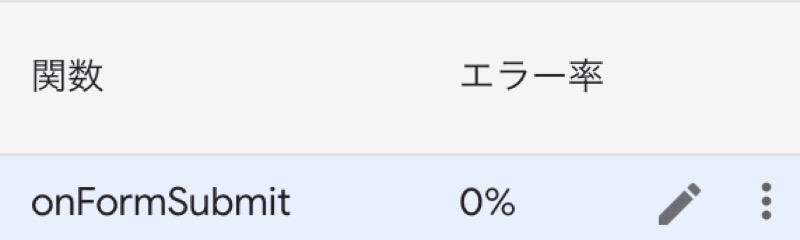

警告画面が出るので、
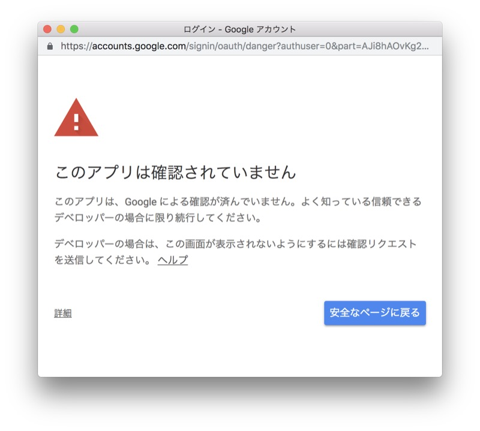

「詳細」をクリックして、「〜〜（安全ではないページ）に移動」をクリックします。
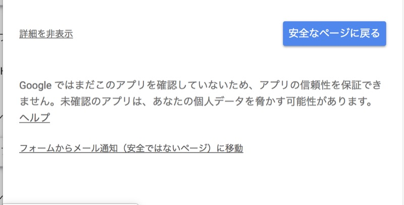

「許可」をクリックします。
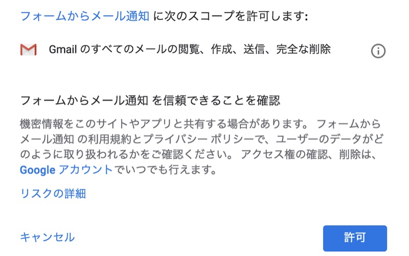

そしたらフォームを送信してみましょう。

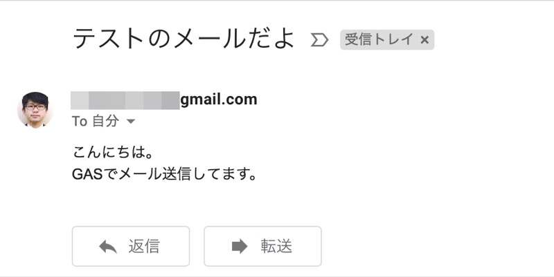

メールが来ましたね。

これでフォーム送信時にメールを送るところまでできました。
<br/>
おめでとうございます。

## フォーム回答に入っているデータを取り出す

現段階では件名や本文は固定値でしかメールが送れないのでつまらないですね。
<br/>
フォームに入力された内容をメールに代入して送るようにしてみましょう。

#### フォーム入力された内容はどうやって取得できるのか？

今まで放置してたんですが、トリガーで実行される関数の引数(e)には、
<a href="https://developers.google.com/apps-script/guides/triggers/events" target="_blank" rel="noopener noreferrer">Event</a>
オブジェクトというものが渡されます。

Eventオブジェクトの中には、トリガーが発生したときの色々な情報がセットされています。

「フォーム送信時」のトリガーにより渡されるeventオブジェクトには、フォームの回答などの情報が入ってくるので、ここから必要な情報を取り出してやれば良いです。

#### 回答を取り出してみる

次のようにすると、質問と回答がセットで入っている、
<a href="https://developers.google.com/apps-script/reference/forms/item-response" target="_blank" rel="noopener noreferrer">ItemResponce</a>
というクラスのオブジェクトの配列が取れます。

```js
var itemResponces = e.responce.getItemResponces();
```

それぞれのItemResponceオブジェクトで、

```js
itemResponce.getItem().getTitle()
```

とすれば質問のタイトルが取れます。戻り値はStringです。

```js
itemResponce.getResponce()
```

とすれば回答が取れます。戻り値はだいたいStringです。

質問の形式によってはStringの配列だったりします。

というわけで、試してみましょう。
<br/>
コードを以下のように書いてください。

```js
FormApp.getActiveForm();
function onFormSubmit(e) {
  var email = 'yout-email@example.com';
  var subject = 'テストのメールだよ';
  var body = 'こんにちは。\nGASでメール送信してます。';
  GmailApp.sendEmail(email, subject, body);
  var itemResponses = e.response.getItemResponses();
  itemResponses.forEach(function(itemResponse, index){
    Logger.log('質問'+ index + ': ' + itemResponse.getItem().getTitle());
    Logger.log('回答'+ index + ': ' + itemResponse.getResponse());
  })
}
```

どうもスクリプトの中で対象となるフォームを特定しなきゃいけないみたいで、コードの一番始めに、

```js
FormApp.getActiveForm();
```

と書く必要があります。書かないとEventオブジェクトからresponseのプロパティにアクセスできません。
<br/>
割と最近GASのトリガー実行周りの仕様が変わってるみたいですね。

参考:
<a href="https://ja.stackoverflow.com/questions/50010/google%E3%83%95%E3%82%A9%E3%83%BC%E3%83%A0%E3%81%AE%E3%82%B9%E3%82%AF%E3%83%AA%E3%83%97%E3%83%88%E3%81%AE%E6%96%B0%E3%81%97%E3%81%84%E3%83%88%E3%83%AA%E3%82%AC%E3%83%BC%E8%A8%AD%E5%AE%9A%E7%94%BB%E9%9D%A2%E3%81%A7%E3%83%88%E3%83%AA%E3%82%AC%E3%83%BC%E8%A8%AD%E5%AE%9A%E3%81%99%E3%82%8B%E3%81%A8-%E3%82%A4%E3%83%99%E3%83%B3%E3%83%88%E3%81%8C%E3%81%86%E3%81%BE%E3%81%8F%E6%B8%A1%E3%82%89%E3%81%AA%E3%81%8F%E3%81%AA%E3%82%8A%E3%81%BE%E3%81%97%E3%81%9F-%E4%BB%8A%E3%81%BE%E3%81%A7%E3%81%AE%E3%82%B9%E3%82%AF%E3%83%AA%E3%83%97%E3%83%88%E3%81%AF%E4%BD%BF%E3%81%88%E3%81%AA%E3%81%8F%E3%81%AA%E3%81%A3%E3%81%9F%E3%81%AE%E3%81%A7%E3%81%97%E3%82%87%E3%81%86%E3%81%8B" target="_blank" rel="noopener noreferrer">Googleフォームのスクリプトの新しいトリガー設定画面でトリガー設定すると、イベントがうまく渡らなくなりました。今までのスクリプトは使えなくなったのでしょうか？</a>

コードを保存して、フォームを送信してみます。

と行きたいとこなんですが、
<a href="https://developers.google.com/apps-script/reference/forms/form-app" target="_blank" rel="noopener noreferrer">FormApp</a>
クラスを使うときは、セキュリティ対策のため、改めて実行の許可をしてやる必要があります。

メール送信のときと同じようにトリガーを再設定して、許可してください。

フォームを送信してみます。

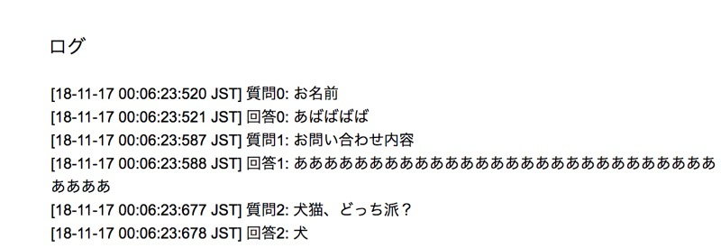

メニューの「表示」→「ログ」を開くと、フォームに入力した内容が取得できていることが確認できましたね。

あとは値をメールの本文に代入してやれば完成です。

```js
FormApp.getActiveForm();
function onFormSubmit(e) {
  var email = 'your-email@example.com';
  var subject = 'フォームが送信されました';
  var body = 'こんにちは。\n';
  body += 'Googleフォームの「' + e.source.getTitle()　+ '」に回答が送信されました。\n\n';
  var itemResponses = e.response.getItemResponses();
  itemResponses.forEach(function(itemResponse){
    body += '【' + itemResponse.getItem().getTitle() + '】\n'
    body += itemResponse.getResponse() + '\n\n'
  });
  GmailApp.sendEmail(email, subject, body);
}
```

フォームを送信するとこんなメールが届くようになりました。

おめでとうございます。

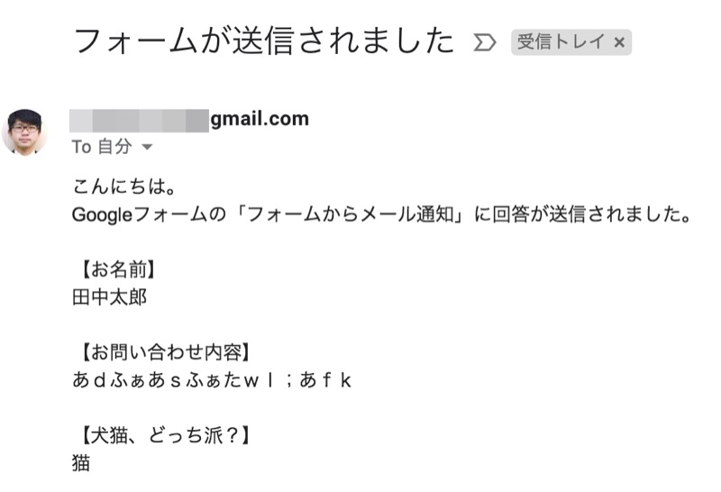

`e.source.getTitle()`がうまくいかない場合は一度フォームのタイトルを変更してみてください。

以上です！
<br/>
お疲れ様でした。
