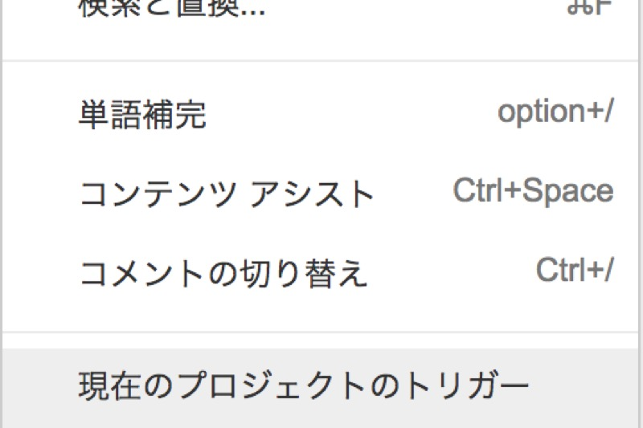
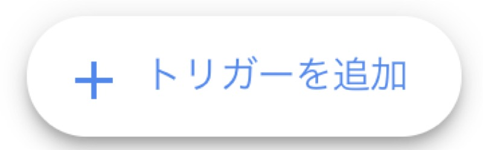
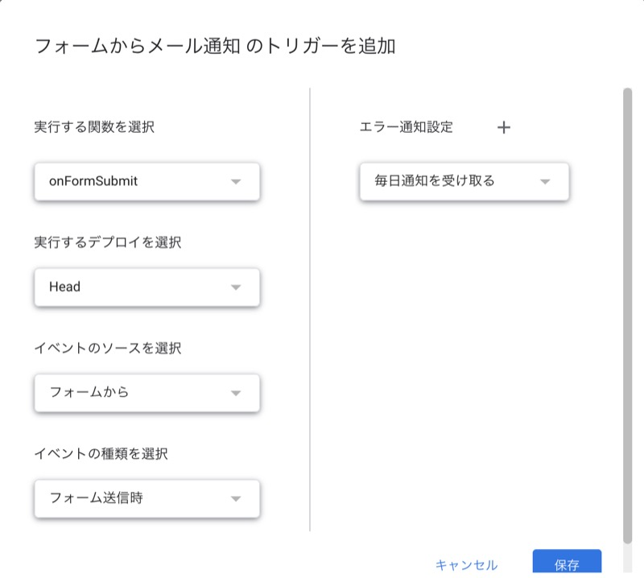
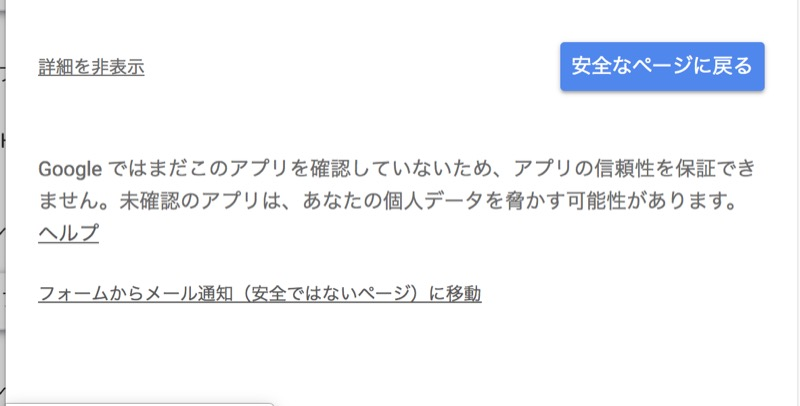

こんにちは！

この記事では、

- 「Google Apps Scriptを自動実行したい」
- 「トリガーってどうやって使うの？」

といった方に向けて、GASのトリガーについて詳しく解説します。

##  トリガーとは

トリガーとは、Google Apps Scriptで作成した処理を、特定の条件のときに自動で実行する仕組みです。

例えば、
- フォームが送信されたときに〇〇を実行
- スプレッドシートを開いたときに〇〇を実行

というようなことができます。

##  トリガーの種類

まず、GASのトリガーには大きく分けて2種類あります。

プロジェクトを作成すると特に設定せずとも使えるようになっている
<a href="https://developers.google.com/apps-script/guides/triggers/" target="_blank" rel="noopener noreferrer">Simple triggers</a>
と、 自分で実行内容を設定する
<a href="https://developers.google.com/apps-script/guides/triggers/installable" target="_blank" rel="noopener noreferrer">Installable triggers</a>
です。

Installable triggersは、Simple triggersの上位互換みたいなものなので、Installable triggersを使っておけばだいたいOKです。

今回はInstallable triggersを説明していきます。

Installable triggersには以下のものがあります。
<br/>
Time-drivenを除くと、それぞれ、プロジェクトが紐づくスプレッドシートやフォームで特定の操作が行われたときに発動します。

###  Open (起動時)

ファイルが開かれたとき実行。

###  Edit (編集時)

_※スプレッドシートのみ_

セルの内容が変更されたとき実行。

###  Change (変更時)

_※スプレッドシートのみ_

スプレッドシートの構造が変更されたとき（シートや列の追加、削除など）実行。


###  Form submit (フォーム送信時)

#### （フォームの場合）

フォームが送信されたとき実行。

#### （スプレッドシートの場合）

フォーム回答内容をスプレッドシートに書き込まれるときに実行。

### Time-driven (時間駆動型)

一定時間ごと、または特定の日時に実行。

## スクリプトをどんな感じでつくるのか？

トリガー発動時に実行したい処理を関数にしておけばOKです。

```js
 function test() {
  var sheet = SpreadsheetApp.getActiveSpreadsheet().getActiveSheet();
  var cell = sheet.getRange(1, 1);
  cell.setValue('更新日時: ' + new Date());
}
```

こんな感じのコードを書いてスプレッドシートの「変更時」トリガーで実行する関数として登録すれば、
<br/>
内容変更時にその時の日時が書き込まれるようになります。

また、トリガーで実行する関数には、そのトリガーのイベント情報(Event Objects)が引数として渡されますので、
<br/>
それをスクリプトの中で使うこともできます。


```js
function test(e) {
}
```

こんな感じで関数に引数を指定しておけば使えます。

「フォームの送信時に回答内容をメール送信したい・・・！」みたいな時に使うことになります。

イベントオブジェクトに入っている情報は、トリガーごとに異なっています。
<br/>
例えば、

**スプレッドシートの「変更時」**
<br/>
イベントオブジェクトには 変更した範囲、元の値、変更後の値などが入ります。

**フォームの「送信時」**
<br/>
イベントオブジェクトには 回答内容などが入ります。

公式のドキュメントはこちら。
<br/>
<a href="https://developers.google.com/apps-script/guides/triggers/events" target="_blank" rel="noopener noreferrer">https://developers.google.com/apps-script/guides/triggers/events</a>

こちらの記事で、イベントオブジェクトを使ってメール送信するスクリプトの作り方を紹介しています。
<br/>
<a href="/gas-form-send-email-tutorial/">【GAS入門】フォームの回答があったらメール通知するスクリプトを作ってみよう</a>
<br/>
合わせてどうぞ！

##  トリガーの設定方法

スクリプトエディタの「編集」→「現在のプロジェクトのトリガー」をクリックすると、トリガーの一覧画面が開きます。



「トリガーを追加」を押すと設定画面が開きます。



イベントのソース、イベントの種類、実行する関数を選択して保存を押します。
<br/>
（その他の項目は基本的にデフォルトでOKです）



初回の設定時には、「このアプリは確認されていません」といったエラーが出ますので、
<br/>
「詳細」→「〜〜〜（安全では無いページ）に移動」をクリックして実行を許可する必要があります。



GASはやろうと思えばGoogleアカウントを使ったいろいろができてしまうので、セキュリティのためにプロジェクトごとに実行を許可する必要があるんですね。

以上です！

<a href="https://twitter.com/zzzaaawwwaaa" target="_blank" rel="noopener noreferrer">質問などはTwitterにお願いします！</a>
