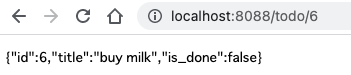

Goのフレームワークの1つである<a href="https://goa.design/" target="_blank" rel="noopener noreferrer">Goa</a>を試してみました。

簡単なCRUDを実装するところまで、解説していきます。

なお、Rubyしかまともに使ったことのない人間が書いているので、書き方まずかったりするかもしれませんが、ご了承ください。

記事内で作成したソースはこちらに置きました。

<a href="https://github.com/KobayashiTakaki/goa_todo" target="_blank" rel="noopener noreferrer">https://github.com/KobayashiTakaki/goa_todo</a>


## モジュールの作成

最初の方は公式のチュートリアルに従ってやっていきましょう。

https://goa.design/learn/getting-started/

モジュールを適当な名前で作成しちゃいます。
最終的に、TODOリストを管理するようなAPIを作ろうと思うので、todoにしておきます。

```
mkdir todo
cd todo
go mod init todo
```

## Goaモジュールの取得

go getでGoaを取ってきます。

```
go get -u goa.design/goa/v3
go get -u goa.design/goa/v3/...
```

## Designの作成

Goaを取ってきましたら、まずは"Design"と呼ばれるコードを書きます。

DesignはGoaの特徴的な仕組みで、APIの設計書、仕様書的な役割になるコードです。

APIがどういう形の値を受け取って、どういう形の値を返却するか、みたいなことを書いていきます。

GoaはAPIの動作に必要なコードを自動生成する仕組みがあるのですが、それはこのDesignを元に生成されます。

また、Designを元にして自動でAPIのドキュメント(Swagger)を生成してくれたりするようです。

ではやっていきましょう。ファイルを作ります。

```
mkdir design
touch design/design.go
```

ひとまず、文字列を受け取って、別の文字列にして返すAPIを実装していくことにしましょう。

早速ですが、出来上がったものがこちらになります。

```go
package design

import . "goa.design/goa/v3/dsl"

var _ = API("todo", func() {
	Title("Todo Service")
	Description("Service that manage todo.")
	Server("todo", func() {
		Host("localhost", func() { URI("http://localhost:8088") })
	})
})

var _ = Service("todo", func() {
	Description("Service that manage todo.")
	Method("hello", func() {
		Payload(func() {
			Attribute("name", String, "Name")
			Required("name")
		})
		Result(String)
		HTTP(func() {
			GET("/hello/{name}")
			Response(StatusOK)
		})
	})
})
```

解説していきます。

大きく分けて、`API`と`Service`という関数を実行していますね。

`API`の方は、APIの全体を通した説明とかタイトルとかをつけられるものです。
あと、どのURLで待ち受けするかとかも書いておけます。

今回は適当な説明と、localhostで待ち受けするように書きました。

続いて、`Service`の方ですが、こちらで具体的なAPIのメソッド達を定義していきます。

Methodを複数まとめるのがServiceで、Serviceは複数存在しうる、という感じです。

ここでは、"todo"という名前のServiceを作り、その中で"hello"という名前のメソッドを作りました。

```go
Service("todo", func() {
	Method("hello", func() {

	})
})
```

`Method`の中では、`Payload`でどんな値を受け取るか、`Result`でどんな値を返すかを書きます。

```go
Method("hello", func() {
	Payload(func() {
		Attribute("name", String, "Name")
		Required("name")
	})
	Result(String)
	HTTP(func() {
		GET("/hello/{name}")
		Response(StatusOK)
	})
})
```

`Payload`の中では`Attribute`で受け取る値の名前と型を書きます。

ここでは、"name"という名前で、文字列を受け取ることにします。

```go
Attribute("name", String, "Name")
```

`Required`とすると、必須だよという定義になるようです。

```go
Required("name")
```

`Result`で返り値の型を書きます。今回は文字列にします。

```go
Result(String)
```


`HTTP`では、HTTPリクエストと、サービスのメソッドの関連付けを行います。

```go
HTTP(func() {
	GET("/hello/{name}")
	Response(StatusOK)
})
```

GETで一致するパスにリクエストが来たら、"hello"メソッドが実行されることになります。

`{}`で先ほど定義したAttributeの名前を囲って書いておくと、その部分がプレースホルダになり、この部分に入った文字列をPayloadとして受け取ることができます。

`Response`はレスポンスするステータスとかを定義するものです。とりあえず正常系だけ書いておきます。

## コードの生成

Designは最低限できました。続いてAPIの動作に必要なコードを自動生成します。

コマンドを実行するだけです。

```
goa gen todo/design
```

`gen`ディレクトリ以下に色々とファイルが自動的に作成されます。

ここに生成されたファイルは編集しません。そのまま置いておけばOKです。

続いて、処理を実装してくための雛形を生成します。

```
goa example todo/design
```

コマンドを実行すると、ルートディレクトリに`todo.go`、`cmd`ディレクトリ以下にいくつかファイルが生成されます。

これらのファイルに最低限の処理が実装済みの状態になっているので、これをベースに機能を実装していくことになります。

## 簡単なAPIを実装

先程Designで定義した、`hello`メソッドを実装していきましょう。

ルートディレクトリの`todo.go`に、`Hello`メソッドがありますね。Designで`Result(String)`としましたので、メソッドの戻り値はstringです。

```go
func (s *todosrvc) Hello(ctx context.Context, p *todo.HelloPayload) (res string, err error) {
	s.logger.Print("todo.hello")
	return
}
```

引数の`p *todo.HelloPayload`にPayloadが入ってきます。"name"という名前にしたので、`p.Name`とすれば使えます。

名前に挨拶をつけて返すようにしてみます。

```go
func (s *todosrvc) Hello(ctx context.Context, p *todo.HelloPayload) (res string, err error) {
	s.logger.Print("todo.hello")
	return fmt.Sprintf("Hello, %v!", p.Name), nil
}
```

## 動かす

動かしてみましょう。まずはビルドします。

サーバを実行するコードは`./cmd/todo`にあります。

```
go build ./cmd/todo
```

実行します。

```
./todo
```

ブラウザでアクセスしてみましょう。


出ました。おめでとうございます。

公式のチュートリアルではこのレベルまでのことが書いてあります。

## DBを使うには？

値を受け取ってほぼそのまま返すAPIはできましたが、やっぱりDBを使いたいですよね。

公式のサンプルコードだと、これがDBを使っているので参考にしました。

<a href="https://github.com/goadesign/examples/tree/master/cellar" target="_blank" rel="noopener noreferrer">https://github.com/goadesign/examples/tree/master/cellar</a>

このサンプルではBoltという独特のDBを使っていますが、せっかくなので練習がてら標準ライブラリの`database/sql`を使って実装していこうと思いました。（そしたら割と難しかった）

概ね以下のようなことをやれば使えるようになります。

- DBアクセス用の型を作る
- DB接続(`*sql.DB`)を受け取って保持するようにする
- その型のメソッドとして、DB接続を通してDBの操作を行う処理を実装する
- サービスの初期化処理(`NewTodo`)でDB接続を受け取り、DBアクセス用の型をインスタンス化して保持するようにする
- サービスのメソッド内でDBアクセス用の型を通してDBの操作を行うように実装する
- サービスの起動処理(`./cmd/todo/main.go`内)でDB接続をOpenして、サービスの初期化処理に渡す

なんかあんまりよく分からない気もしますがまあいいや。やっていきましょう。

## APIのデザイン(showメソッド)

DBに対してCRUDするようなAPIを作っていくことにします。まずはデータを1件表示するAPIにします。

`./design/design.go`に以下のコードを追加します。

```go
// (略)

var Todo = ResultType("Todo", func() {
	Attributes(func() {
		Attribute("id", Int, "ID")
		Attribute("title", String, "Title")
		Attribute("is_done", Boolean, "IsDone")
	})
})

var _ = Service("todo", func() {
	// (略)

	Method("show", func() {
		Payload(func() {
			Attribute("id", Int, "ID")
			Required("id")
		})
		Result(Todo)
		HTTP(func() {
			GET("/todo/{id}")
			Response(StatusOK)
		})
	})
})

```

`ResultType`というところで、返す値の構造、型を定義しています。`id`, `title`, `is_done`という属性を持たせています。

それと、新しく`Method`を追加しています。

"show"という名前にしました。idを受け取って、対応する1件を返すというイメージです。

`Result`に先ほど`ResultType`で定義した型を指定しています。

Designを編集したら、`goa gen`コマンドでコードを更新しておきましょう。

```
goa gen todo/design
```

## DB周り実装の準備

`database/sql`を使うにあたっては、使いたいDBに応じたdriverと呼ばれるモジュールが必要になります。

今回は簡易にsqlite3を使うことにします。

sqlite3用のdriverを取得しておきます。

```
go get github.com/mattn/go-sqlite3
```

続いて、DBの作成を手動でやってしまいます。

DBファイルを作成

```
sqlite3 ./db.sqlite3
```

テーブル作成

```sql
create table todos (
    id integer primary key autoincrement,
    title text not null,
    is_done boolean not null default false
);
```

レコード1件追加

```sql
insert into todos (title) values ('buy milk');
```

データが入ってますね。

```
sqlite> select * from todos;
1|buy milk|0
```


## DBアクセス用の型を作る

続きまして、DBアクセス用の処理を作っていきます。

ルートに`db.go`という名前でファイルを作りました。

Findメソッド(1件検索)の実装までした状態です。

```go
package todoapi

import (
	"database/sql"
	todo "todo/gen/todo"

	_ "github.com/mattn/go-sqlite3"
)

type Sql struct {
	db *sql.DB
}

func NewSqlDB(db *sql.DB) *Sql {
	return &Sql{db}
}

func (s *Sql) Find(id int) (*todo.Todo, error) {
	var t todo.Todo
	err := s.db.QueryRow("select id, title, is_done from todos where id = ?", id).Scan(&t.ID, &t.Title, &t.IsDone)
	if err != nil {
		return nil, err
	}
	return &t, nil
}
```

`Sql`という型（名前が適当ですが）を定義して、DBへの接続`*sql.DB`を保持するようにしています。

`NewSqlDb`という関数で、`Sql`を生成できるようにしています。

`Sql`のメソッドとして`Find`を実装しています。idを受け取って、SQLを実行して、取得した結果を`.Scan`で変数(構造体)に入れています。

クエリの結果を入れる`todo.Todo`ですが、これは`goa gen`コマンドで自動生成されたものを使っています。

Designに`ResultType`で定義すると、それに対応した型が生成されます。

この後でshowメソッドを実装する際に、Designでは`Result`に`Todo`を指定しましたが、メソッドの戻り値の型もこの`todo.Todo`にすることになります。

## サービスの型にDBアクセス用のオブジェクトを持たせる

DBアクセス用の型ができたので、これをサービス内で使用できるようにします。

`./todo.go`を以下のように修正します。

```go
// (略)

type todosrvc struct {
	db     *Sql
	logger *log.Logger
}

func NewTodo(db *sql.DB, logger *log.Logger) todo.Service {
	sql := NewSqlDB(db)
	return &todosrvc{sql, logger}
}

// (略)
```

`todosrvc`のフィールドとして`*Sql`を追加し、`NewTodo`の中で`NewSqlDB`で`*Sql`を生成し、持たせます。

`NewSqlDB`を実行できるように、`NewTodo`の引数として`*sql.DB`を受け取るようにします。

---

`NewTodo`の引数を変えたので、この関数を呼んでいる箇所で渡している引数も変更する必要がありますね。

どこで呼ばれているのかというと、`./cmd/todo/main.go`の中です。

`main`関数の中でloggerをセットアップしているあたりを以下のように変更します。

```go
func main() {
	// (略)
	// Setup logger. Replace logger with your own log package of choice.
	var (
		logger *log.Logger
	)
	{
		logger = log.New(os.Stderr, "[todoapi] ", log.Ltime)
	}
	var (
		db *sql.DB
	)
	{
		var err error
		db, err = sql.Open("sqlite3", "./db.sqlite3")
		if err != nil {
			log.Fatal(err)
		}
		defer db.Close()
	}

	// Initialize the services.
	var (
		todoSvc todo.Service
	)
	{
		todoSvc = todoapi.NewTodo(db, logger)
	}
	// (略)
}
```

`sql.Open`でDB接続をオープンし(`*sql.DB`が取れる)、`NewTodo`の引数として渡します。

`defar db.Close()`で最終的にはクローズされるようにしておきます。

## showメソッドの実装

さて、長かったですがここまででAPIからDBを操作する準備が整いました。

APIのメソッドを実装していきましょう。

Designで定義したのが`show`メソッドでしたね。

どんな値を返すべきかの定義は、`goa gen`コマンドにより、`./gen/todo/service.go`に書かれています。

```go
type Service interface {
	// Hello implements hello.
	Hello(context.Context, *HelloPayload) (res string, err error)
	// Show implements show.
	Show(context.Context, *ShowPayload) (res *Todo, err error)
}
```

このインターフェース`Service`は、`NewTodo`の戻り値の型になっているので、このインターフェースを満たすメソッドを実装しておく必要があります。

`./todo.go`にこんな感じに実装してみました。

```go
func (s *todosrvc) Show(ctx context.Context, p *todo.ShowPayload) (res *todo.Todo, err error) {
	s.logger.Print("todo.show")
	t, err := s.db.Find(p.ID)
	if err != nil {
		return nil, err
	}
	return t, nil
}
```

PayloadとしてIDを受け取るようにしてあるので、`p.ID`でIDを取得できます。

`s.db`に`*Sql`が入っていますから、そいつの`Find`にIDを渡してDBからデータを取得します。

`Find`の戻り値は`*todo.Todo`にしてありますので、そのまま返せばOKです。

ではbuildして実行してみましょう。

```
go build ./cmd/todo
./todo
```

ブラウザでアクセスしてみます。


見れましたね。おめでとうございます。

## createメソッドの実装

データの登録用のメソッドも作っていきます。

まずはDesignを編集します。

```go
var _ = Service("todo", func() {
	// (略)

	Method("create", func() {
		Payload(func() {
			Attribute("title", String, "Title")
			Required("title")
		})
		Result(String)
		HTTP(func() {
			POST("/todo")
			Response(StatusOK)
		})
	})
})
```

"create"メソッドを作ります。Payloadとしてtitleを受け取り、新しいデータを登録するということにします。

戻り値はStringで作成したレコードのIDでも返すことにしましょう。

Designを編集したので`goa gen`しましょう。

```
goa gen todo/design
```

`todosrvc`に`Create`メソッドを実装することになります。

```go
func (s *todosrvc) Create(ctx context.Context, p *todo.CreatePayload) (res string, err error) {
	s.logger.Print("todo.create")
	id, err := s.db.Create(p.Title)
	if err != nil {
		return "", err
	}
	return fmt.Sprint(id), nil
}
```

こんな感じです。

`p.Title`で受け取ったtitleが取れますので、それをDBアクセス用オブジェクトの`Create`メソッドに渡します。


DBの方の`Create`メソッドがまだないので、実装します。

`./db.go`に以下を書きます。

```go
func (s *Sql) Create(title string) (int, error) {
	res, err := s.db.Exec("insert into todos (title) values (?)", title)
	if err != nil {
		return 0, err
	}
	id, err := res.LastInsertId()
	if err != nil {
		return 0, err
	}
	return int(id), nil
}
```

`title`を受け取って、`insert`を実行すればいいですね。

`Exec`の戻り値から`LastInsertId`で新しく作られたレコードのIDが取れるようなので、それを返すことにします。

実装はこれでOKなので動かしてみましょう。

```
go build ./cmd/todo
./todo
```

待受のHTTPメソッドはPOSTにしたので、Postman等のツールを使うと確認できます。




データが登録されました。登録処理完成です。

## updateメソッドの実装

次はupdate作っていきます。

Designです。

```go
var _ = Service("todo", func() {
	// (略)

	Method("update", func() {
		Payload(func() {
			Attribute("id", Int, "ID")
			Attribute("is_done", Boolean, "IsDone")
			Required("id")
			Required("is_done")
		})
		Result(String)
		HTTP(func() {
			POST("/todo/{id}")
			Response(StatusOK)
		})
	})
```

"is_done"をBooleanで受け取って、IDに対応するレコードを更新することにします。

`goa gen`します。

```
goa gen todo/design
```

サービスのメソッド実装。

```go
func (s *todosrvc) Update(ctx context.Context, p *todo.UpdatePayload) (res string, err error) {
	s.logger.Print("todo.update")
	id, err := s.db.Update(p.ID, p.IsDone)
	if err != nil {
		return "", err
	}
	return fmt.Sprint(id), nil
}
```

`p.ID`と`p.IsDone`をDBアクセス用オブジェクトの`Update`に渡します。

DB側のメソッド実装。

```go
func (s *Sql) Update(id int, is_done bool) (int, error) {
	_, err := s.db.Exec("update todos set is_done = ? where id = ?", is_done, id)
	if err != nil {
		return 0, err
	}
	return int(id), nil
}
```

できた。実行します。

```
go build ./cmd/todo
./todo
```

Postmanでリクエスト送信してみます。


"is_done"がtrueになってますね。更新処理完成です。

### cliを使う

Goaには、コマンドラインからAPIのメソッドを実行できるcliがあります。

ビルドして、

```
go build ./cmd/todo-cli
```

こんな感じで実行するとAPIの処理を呼び出せます。

```
./todo-cli --url="http://localhost:8088" todo update --id 4 --body '{"is_done": true}'
```

動作確認とかに良さそうです。


## deleteメソッドの実装

最後、deleteメソッド実装していきます。

同じような感じです。

Design

```go
var _ = Service("todo", func() {
	// (略)

	Method("delete", func() {
		Payload(func() {
			Attribute("id", Int, "ID")
			Required("id")
		})
		Result(String)
		HTTP(func() {
			POST("/todo/{id}/delete")
			Response(StatusOK)
		})
	})
```

IDだけ受け取ればいいですね。

`goa gen`実行

```
goa gen todo/design
```

サービスのメソッド実装。

```go
func (s *todosrvc) Delete(ctx context.Context, p *todo.DeletePayload) (res string, err error) {
	s.logger.Print("todo.delete")
	id, err := s.db.Delete(p.ID)
	if err != nil {
		return "", err
	}
	return fmt.Sprint(id), nil
}
```

DB側のメソッド実装。

```go
func (s *Sql) Delete(id int) (int, error) {
	_, err := s.db.Exec("delete from todos where id = ?", id)
	if err != nil {
		return 0, err
	}
	return int(id), nil
}

```

できた。実行します。

```
go build ./cmd/todo
./todo
```

Postmanでリクエストを投げて、そのIDのレコードを表示しようとすると


データが取れなかったよというエラーが出ました。

```
sqlite> select * from todos where id = 3;
sqlite>
```

データベースからもちゃんと削除されてますね。削除処理完成です。

---

最低限ではありますが、これでCRUDを実装できましたね。お疲れさまでした。

## 感想

### 機能がシンプル

フレームワークとして提供される機能はシンプルだなと思いました。自分で作らないといけない部分が多い感じです。

まあ僕がRuby on Railsしかまともに使ったことがないのもあるんですが（Railsは機能が超リッチ）。

DB使えるようにするまでが難しかったですね。Railsとかなら設定ファイルをチョチョイと書くだけで使えてしまうので。

### Designによって仕様が明確になる

Goaの良さそうなところは、Designという仕組みと、Goに型があることにより、APIの仕様が明確になる（実装が強制される）ことかなと思いました。

例えばRailsだと、パスはまあすぐ分かるんですが、どんなパラメータ受け取るのかとか、どんな値を返すのかは実装頼みになってしまいます。

対してGoaでは、Designで書いたとおりに機能を実装する必要があるので、Designが信頼できる仕様書となるんですね。

APIでやり取りするシステムを構築する際にはありがたかったりするんだろうなと想像しました。

---

以上です。
