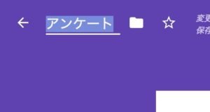
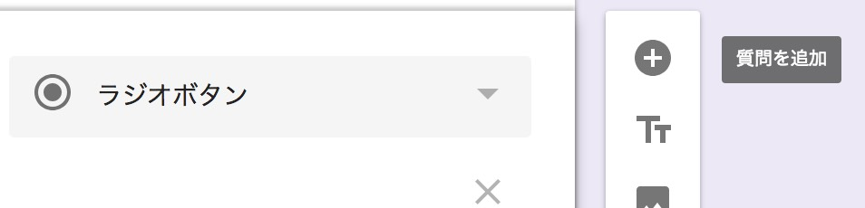
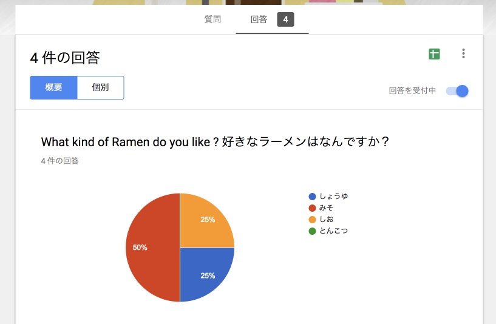
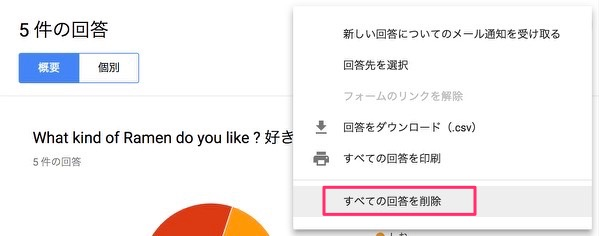

こんにちは！

この記事では、

- 「Googleフォームって何ができるの？」
- 「Googleフォームを使ってみたいけどやり方が分からない！」

といった方に向けて、出来るだけ丁寧に解説していきます。

## Googleフォームとは

Googleドライブのサービスの一つとして提供されている、「フォーム」を簡単に作れるサービスです。

「フォーム」とは、アンケート、とか、お問い合わせフォームみたいなやつで、「質問と回答入力欄がセットになった書式」の総称です。

Googleフォームを使うと、パソコンやスマホで回答できるフォームを超簡単に作れます。

例えば、「イベント来場者向けのアンケート」とか

「お問い合わせフォーム」とか

「飲み会の日程調整アンケート」とか

が作れたりします。

GoogleフォームはGoogleアカウントを持っていれば無料で利用できます。

## Googleフォームを作ってみよう

それでは1つ簡単なフォームを作ってみましょう。

作成はGoogleドライブから行えます。

Googleドライブを開き、左上にある「新規」をクリックします。
 
開いたメニューから「その他」→「Googleフォーム」をクリックします。

これでフォームが新規作成されました。
 
(右上の人は私のGoogleアカウントのアイコンなので気にしないでください😎)

まずはタイトルをつけてみましょう。真ん中の大きい文字の箇所です。

左上の名前のところをクリックすると、自動的にタイトルと同じ内容に変わります。

フォームのタイトルと左上の名前、何が違うのかというと、左上はGoogleドライブ上のファイル名にあたるものです。
 
とりあえずはフォームのタイトルと同じにしておけば良いです。

Googleドライブの共通の機能として、内容を編集するたびに自動保存が行われます。

右上の「・・・」をクリックして、「元に戻す」をクリックすることで、変更を取り消すことができます。
 
間違って書き換えてしまったときでも安心ですね。

フォームの質問を作成していきましょう。
 
既に「無題の質問」というのが作成されているのでこれを編集します。

また、フォームの右側に浮かんでるアイコンの中から、
 
「質問を追加」（「＋」のアイコン）をクリックすると、質問を追加できます

質問文を入力して、

プルダウンリストから回答の形式が選べます。

いろいろ種類があるのですが、今回はシンプルな

- ラジオボタン
- 記述式
- 段落

を使って作成していきます。

選択式

短文

段落

質問を3つ作成してみました。

画面上部の「テーマをカスタマイズ」（パレットのアイコン）をクリックすると、フォームの見た目を変更できます。

色を選んだり、ヘッダー部分に画像を入れたりすることができます。

色の変更

ヘッダー画像

フォントの設定は、質問文の中の、「半角英数字だけ」しか反映されません。
 
ちょっと残念ですね。

ベーシック

デコラティブ

フォーマル

プレイフル

そんな感じで、完成です！
 
右上の「プレビュー」（目のアイコン）をクリックすると、実際に回答を入力できる画面が開きます。

## 利用者向けに共有しましょう

画面上部にある「送信」を押します。

（ここにある「送信」は、フォームの回答を送信する意味ではなく、フォームのURLを他の人に「送信」する、という意味です。
他のサービスだと「共有」と言っているものに近いです。ややこしいですね。）

手っ取り早いのは、リンクで共有する方法でしょう。
 
「リンク」（鎖のアイコン）をクリックして、URLをコピーできます。

これをメールやLINEで利用者に伝えたり、ホームページに掲載すればOKです。
 
「URLを短縮」にチェックをすると、短いURLを作成してくれます。

## 回答の確認

試しに自分で何件か回答して、送られた回答の結果を確認してみましょう。
 
編集画面の「回答」タブをクリックすると、確認画面が開きます。

質問ごとに自動的に集計してグラフや一覧で表示してくれます。

注意として、回答が集まってから質問を追加、削除したり、回答方式を変更した場合、アンケートと集計結果が一致しなくなってしまいますので避けましょう。

#### 質問を追加した場合
→ それ以前に来た回答は、追加した質問に未回答の状態となる。

#### 質問を削除した場合
→ それ以前に来た、その質問に対する回答が消えてしまう。

#### 回答方式を変更した場合
→それ以前に来た回答は、変更した回答方式に沿っていないものになる。
 
（選択式の質問なのに記述式の回答が入っている、など）

回答を削除することもできます。
 
テストで入力した回答なんかはここで削除してしまいましょう。

「個別」表示で、１件だけ削除する事もできます。

## まとめ

Googleアカウントを持っていれば、Googleドライブから作成できます。
 
質問と回答形式を入力していけば完成です。
 
回答は自動で集計され、グラフや一覧で確認できます。

以上です！
