こんにちは！

この記事では、
「Google Apps Scriptを試してみたいな。何か簡単な例はないかな？」
という初心者の方に向けて、「期限が来たらGoogleフォームを回答できなくする」
スクリプトを作っていきながら、解説していきます。

## Google Apps Scriptの始め方

Googleドライブで作成したファイルを操作するGoogle Apps Scriptを作成するには、
「・・・」より、「スクリプトエディタ」をクリックします。

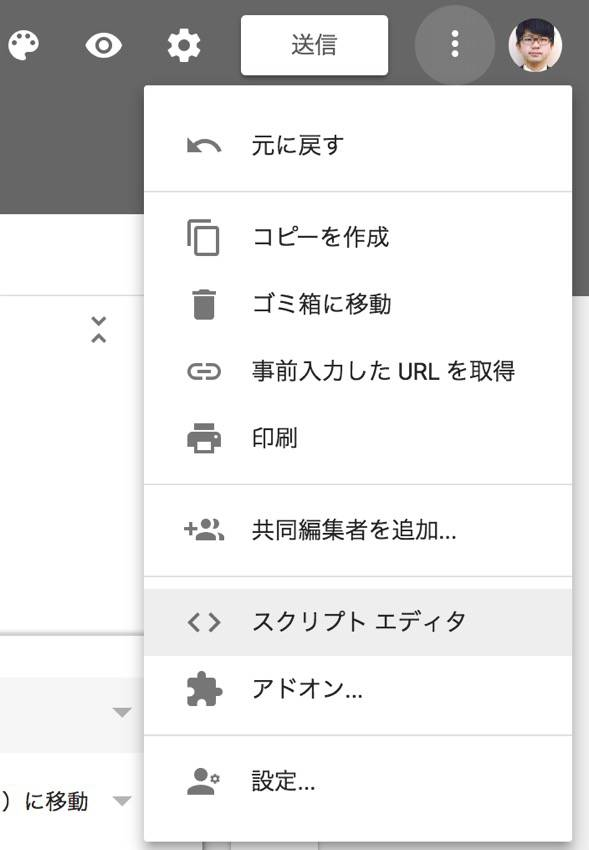

これで、新規のGoogle Apps Scriptの「プロジェクト」が作成されます。
「プロジェクト」とは、作成したプログラムのまとまりと考えてください。
<br>
基本的に、フォームやスプレッドシート等、1つのドキュメントに対して1つのプロジェクトが対応することになります。

## Googleフォームの回答を受け付けなくするスクリプト例と解説

さて、コードに移りましょう。

```js
function myFunction() {

}
```

と空の関数だけがある状態です。

今回は以下のコードに置き換えて、保存してください。

```js
function closeFormAcceptance() {
  var myForm = FormApp.openByUrl("https://docs.google.com/forms/d/1234567890abcdefghijklmnopqrstuvwxyz/");
  myForm.setAcceptingResponses(false);
}
```

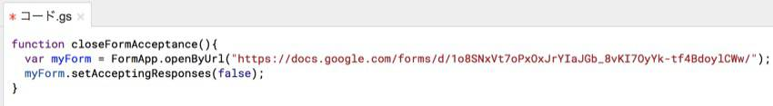

※ FormApp.openByUrl(“……”)のURLの部分には、フォームの編集画面のURLを貼り付けてください。

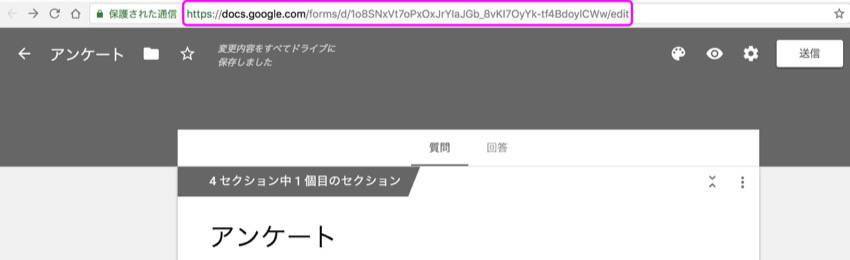

URLの最後の”edit”はあっても無くても動きます。
<br>
しかし、”/“（スラッシュ）は残しておく必要があります。

順を追って解説していきます。

まずはここ。実行する関数名ですね。何でもお好みの名前をつけていいです。

```js
function closeFormAcceptance(){
```

次にこの部分。

```js
var myForm = FormApp.openByUrl("https://docs.google.com/forms/d/1234567890abcdefghijklmnopqrstuvwxyz/");
```

ここでは、操作する対象のフォームのオブジェクトを変数に代入しています。
<br>
型は「
<a href='https://developers.google.com/apps-script/reference/forms/form' target='_blank' rel='noopener noreferrer'>Form</a>
」になります。（Google Apps Scriptに用意されているクラスです）

FormAppというクラスが、Google Apps Scriptでフォームを開いたりできるもので、
<br>
フォームを扱いたいときにはまずこいつを使うことになります。

次にここです。

```js
myForm.setAcceptingResponses(false);
```

変数myFormにはForm型のオブジェクトが入っています。
<br>
そいつが持っている
<a href='https://developers.google.com/apps-script/reference/forms/form#setAcceptingResponses(Boolean)' target='_blank' rel='noopener noreferrer'>setAcceptingResponses()</a>
という関数を実行します。
<br>
引数はBoolean型です。

これは何かというと、フォームの編集画面の「回答」で、回答を受け付けるかどうかを設定できるのですが、

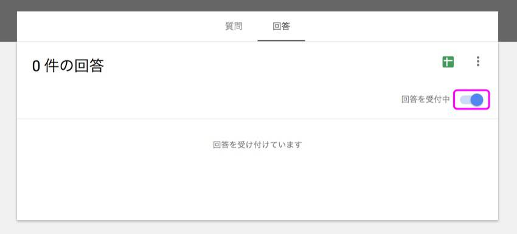

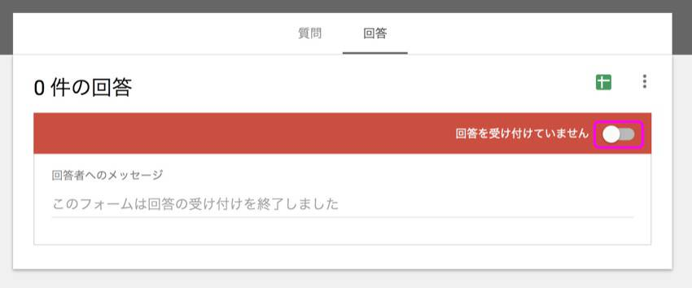

これと同じことをスクリプトから実行できるものです。
<br>
引数にtrueを入れると受付中になり、falseを入れると受け付けなくなります。

コード全体としてやっていることは、
<br>
対象のフォームを開き、そのフォームを回答を受け付けない状態にする、ということになります。

試しに実行してみましょう。
<br>
エディタ画面のメニューに、作成した関数がプルダウン表示されます。

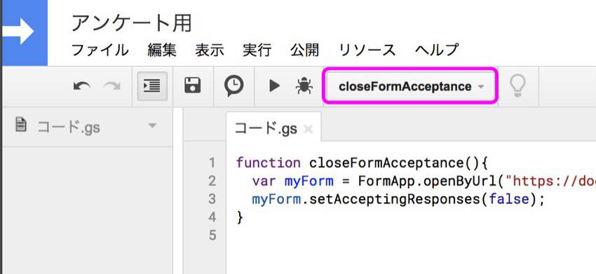

実行したい関数を選択した状態で、「実行」をクリックすると実行できます。

「承認が必要です」というメッセージが出るので、「許可を確認」を押してください。

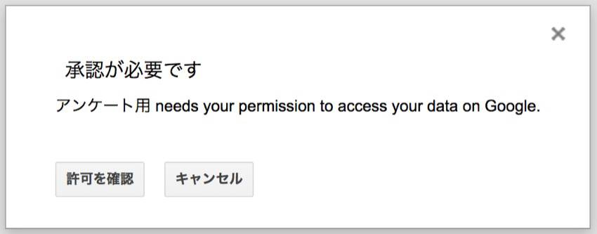

スクリプトを実行するGoogleアカウントを選択して、「許可」を押してください。

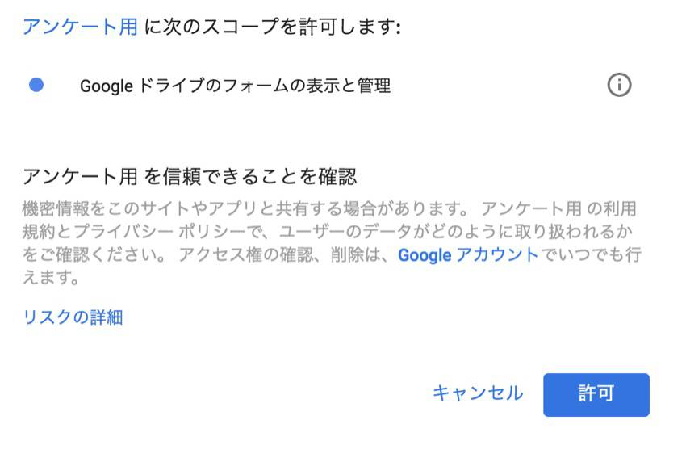

実行するとフォームの回答を受け付けない状態になります。

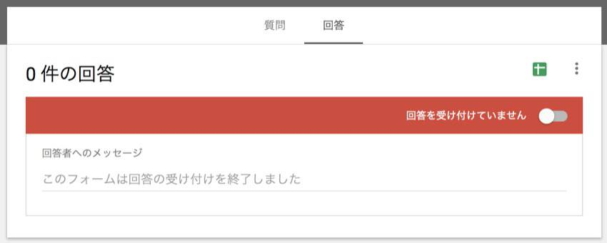

`setAcceptingResponses()`の引数をtrueにして、再度実行すると、
<br>
回答を受け付ける状態に戻ります。

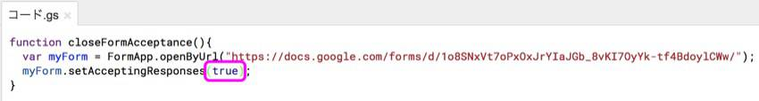


## 時間が来たらスクリプトを実行するようにする

今の状態では手動でしかスクリプトが実行できないので、自動で実行するように設定しましょう。
<br>
フォームの期限が来たら実行するようにしてやればいいですね。

スクリプトを自動実行するには、「トリガー」という仕組みを利用します。
<br>
Google Apps Scriptの「トリガー」にはいくつか種類があるのですが、今回は「
<a href='https://developers.google.com/apps-script/guides/triggers/installable#time_driven_triggers' target='_blank' rel='noopener noreferrer'>時間主導型</a>
」というものを使います。

これは、「○月○日○時になったら実行」とか、「毎日○時に実行」といった、時間指定で実行させるものです。

トリガーの設定方法は2種類あります。
<br>
エディタ画面の「現在のプロジェクトのトリガー」から設定する方法と、トリガー設定の関数を実行する方法です。
<br>
今回は手軽な「現在のプロジェクトのトリガー」から設定する方法を説明します。

エディタ画面の「編集」→「現在のプロジェクトのトリガー」をクリックします。

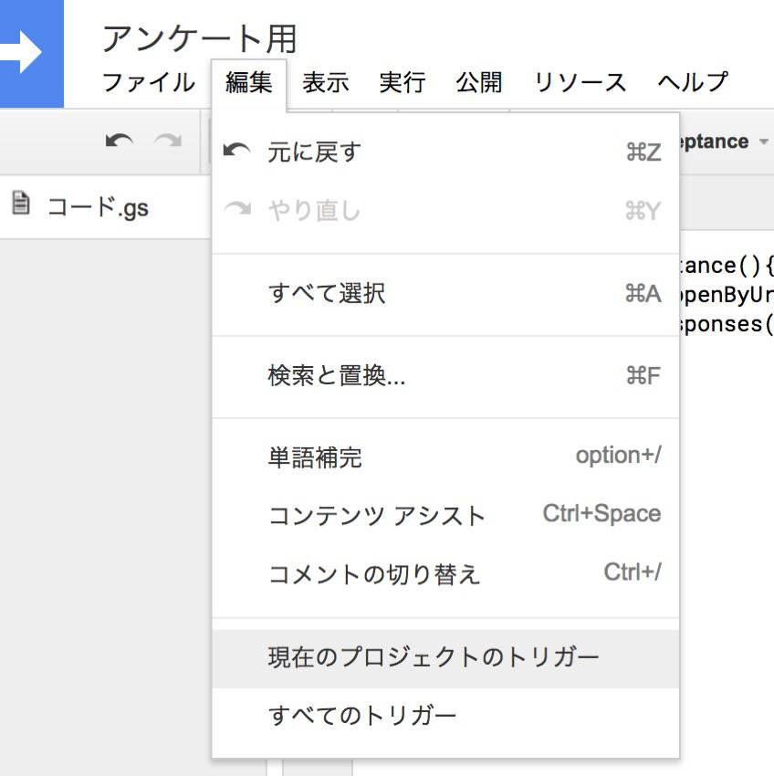

「トリガーが設定されていません。今すぐ追加するにはここをクリックしてください。」という箇所をクリックします。

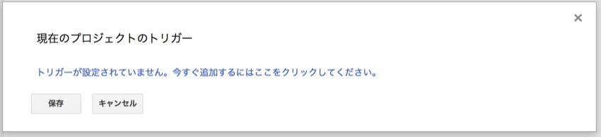

「実行」の箇所に実行したい関数を選択し、「イベント」の箇所には、「時間主導型」、「特定の日時」を選択します。
<br>
「YYYY-MM-DD HH:MM 形式の日付」の箇所に、フォームの回答を締め切る日時を入力します。
<br>
「2018年12月1日00時00分」なら「2018-12-01 00:00」ですね。

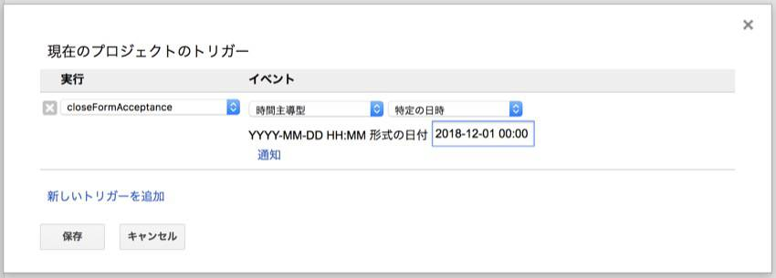

そして「保存」をすれば、設定した日時にスクリプトが自動実行され、フォームが受付しない状態となります。

お疲れ様でした。

フォームの回答をメール通知するスクリプトを解説する記事も書いたので、よろしければ御覧ください。
<br>
<a href='https://takakisan.com/gas-form-send-email-tutorial/' target='_blank' rel='noopener noreferrer'>【GAS入門】Googleフォームの回答があったらメール通知するスクリプトを作ってみよう</a>

以上です！
