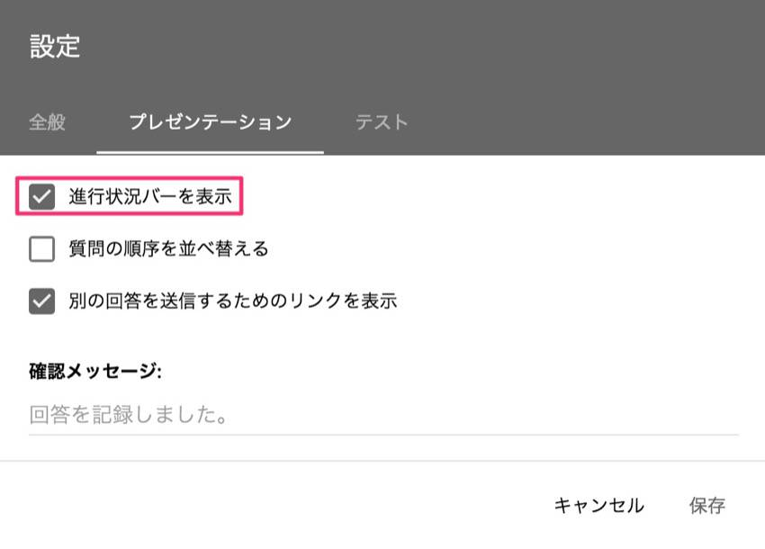

こんにちは！

この記事では、
 
「回答内容に応じて、次に出す質問を分岐させたい」
 
→セクションを使えばできるよ！
 
という内容を解説していきます。

## Googleフォームの「セクション」とは？

セクションは質問の集まりの区切りで、
 
回答するときには、セクション1つにつき1ページ、という形で表示されます。

編集画面の右側にあるメニューの「セクションを追加」をクリックすると追加できます。

フォームの設定より、「プレゼンテーション」→「進行状況バーを表示」を有効にすると、

回答中のセクション（ページ）が何個目なのか、表示されるようになります。

セクションの順番を入れ替えるには、セクションの右上の「・・・」→「セクションを移動」をクリックします。

左側の「・・・」の部分をドラッグして入れ替えられます。

## 回答に応じて次のセクションを変更する方法

質問の形式を「ラジオボタン」または「プルダウン」にすると、選択肢ごとに、どのセクションに移動するかを設定することができます。

質問の右下の「・・・」→「回答に応じてセクションに移動」をクリックします。

すると、選択肢の右側にプルダウンリストが出て、その回答を選んだ場合にどのセクションに進むか、を設定できます。

「フォームを送信」にすると、その選択肢を選んだ時点でフォームの回答が終了します。

## 条件分岐するフォームの例

最初に3つ選択肢があって、選択肢ごとに次の質問を分岐するフォームを作成してみましょう。

まずはセクションを作成していきます。

- セクション1（最初の質問を入れるセクション）
- セクション2（1つ目の選択肢に対応するセクション）
- セクション3（2つ目の選択肢に対応するセクション）
- セクション4（3つ目の選択肢に対応するセクション）

の4つを作ります。

セクション1で選択式の質問を作り、「回答に応じてセクションに移動」を選択します。
 
それぞれの選択肢で、移動するセクションを選択します。

セクション2〜4には、選択肢に対応させる次の質問を作っておきます。

次に、セクション2〜4の下の部分にある、「セクション○以降」というところを、「フォームを送信」にします。

これは、「このセクションの次はどうするか？」を設定するもので、
 
デフォルトでは「次のセクションに進む」となっています。
 
「フォームを送信」にすることで、この質問でフォームが終了するようになります。

「次のセクションに進む」になっていると、1つ目の選択肢に対応する質問の次に、
 
2つ目の選択肢に対応する質問が出てきてしまいますので注意です。

これで完成です！

分岐した先でさらに分岐させることもできるので、やろうと思えばもっと複雑な構造のフォームも作れますね。

以上です！
