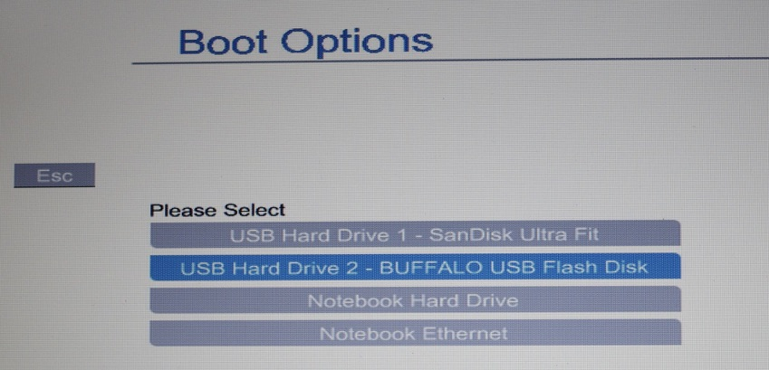
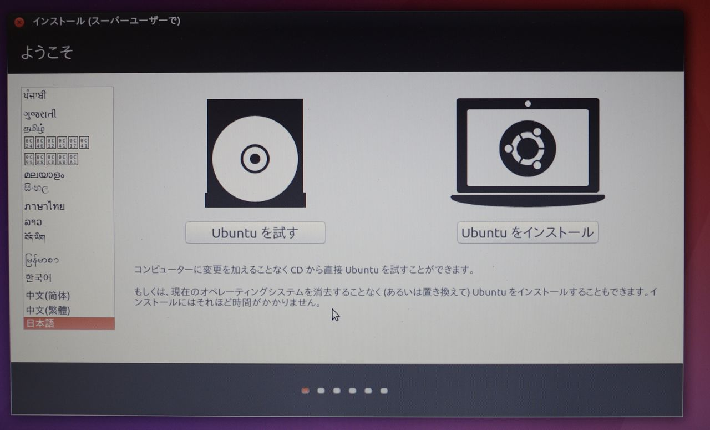
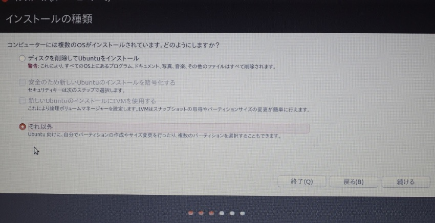
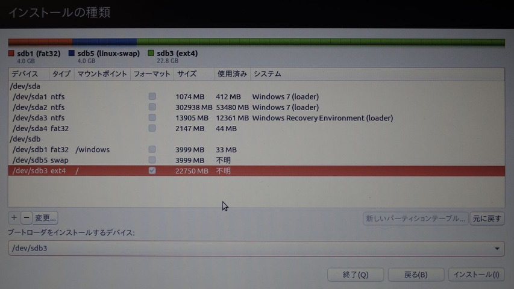
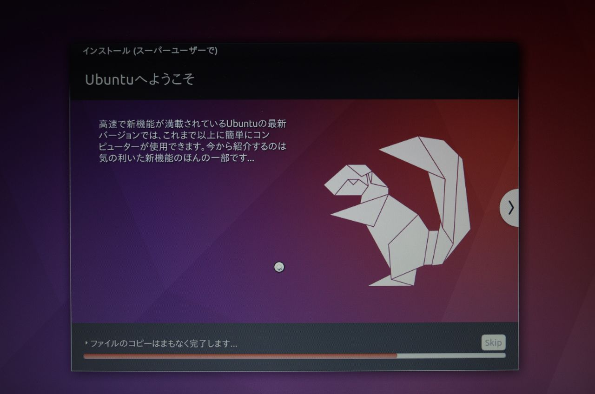
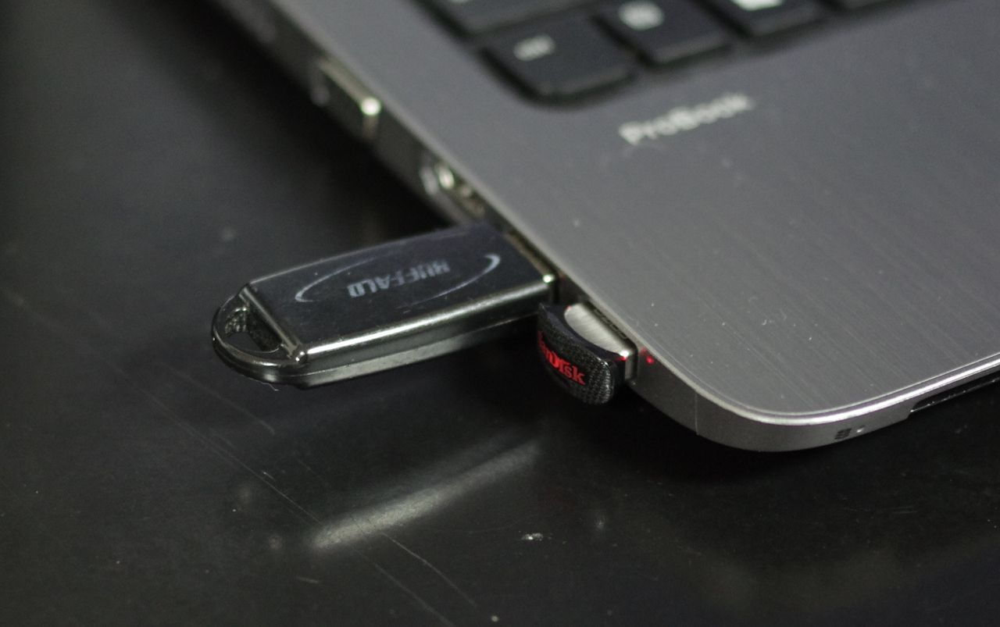
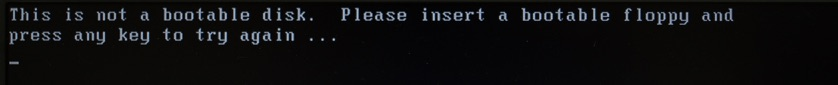
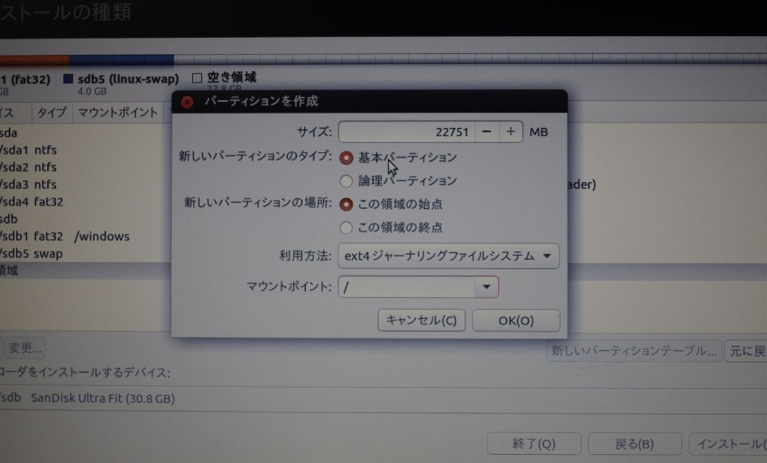
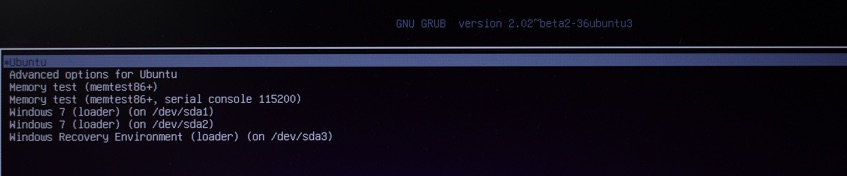
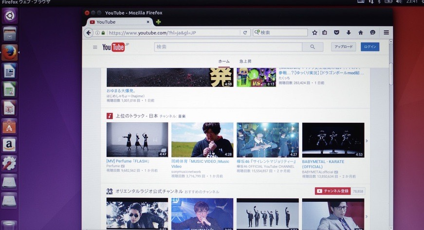

USBメモリにLinuxをインストールして動かすことができると聞いて、
 
面白そうだなとおもってやってみた。
 
ので、その流れを紹介します。

インストールするUSBメモリとして、USB3.0で32GBのUSBメモリを用意した。

## インストーラディスクを作成する

OSをインストールするには、インストーラディスクを作成する必要があります。
 
インストーラディスクでPCを起動して、インストール先としてUSBメモリを使用します。

Linuxにもいろいろあるようですが、
 
デスクトップ環境で利用するディストリビューションとして
 
割とポピュラーっぽいUbuntuをインストールすることにしました。

特にこだわりは無いので、
<a href="https://www.ubuntulinux.jp/" target="_blank" target="_blank" rel="noopener noreferrer">Ubuntu Japanese Team</a>
のページから、
 
一番新しいバージョン(16.04)のインストーラのisoファイルをダウンロードします。
 
こいつを使ってインストーラディスクを作成します。

インストーラディスクを作成するには、isoファイルをDVDに焼くっていう方法もあるんですが、
 
今回は手元にあったUSBメモリ（インストール先に使うのとは別）に書き込みました。

USBメモリでインストーラディスクを作成するのに、Rufusというソフトを使いました。
単にisoファイルをメモリにコピーするだけじゃだめなんですね。

## OSのインストール

出来上がったインストールディスクでコンピューターを起動してみます。

インストーラディスクと、インストール先のUSBメモリをPCに刺した状態で電源を入れて、一番最初に出てくる画面でBIOSメニューを開きます。
このPCではescキーを押すと開けます。

起動ディスクの選択から、インストーラーを書き込んだUSBメモリを選択します。

ubuntuのインストーラーが起動しました。

インストールの種類は、「それ以外」を選択。

ディスクのパーティションの設定の画面が出てきます。
 
現在利用している領域を書き換えたりしないよう気をつけましょう。
 
「/dev/sda」ってのが内蔵のハードディスクの領域ですね。

メモリの最初にFAT32でフォーマットした領域を作っておくと、
 
USBメモリとしてWindowsのマシンとデータやりとりに使えて便利だぞ、
 
という意見を見かけたので、
 
4000MBを/windowsとしてマウント…

USBメモリは書き込み回数に上限があるから、swap領域は作らないほうが良い
 
っていう意見を見かけたが、とりあえず作っといた。
 
4000MBをswap領域に。

残り全部をルートに割り当てた。

ここのブログを参考にしました。
 
<a href="http://cloud-work.net/usb%E3%83%96%E3%83%BC%E3%83%88/usb_install/" target="_blank" rel="noopener noreferrer">UbuntuをUSBメモリにフルインストール。作成/保存したデータをWindowsで読めるようにしてみる。</a>

「ブートローダーをインストールするデバイス」の選択も間違えないようにしよう。
 
ルートに割り当てた領域(/dev/sdb3)を選択した。

で、あとは適当にポチポチして、待つ。

こんな感じ。
 
奥がインストーラディスクにしたUSBメモリ。
 
手前の小さいのがインストールするUSBメモリ。

完了したら再起動！
 
起動ディスクを選択して、

が、駄目！
 
bootableじゃないぞ、と。

3回くらいやり直しして気づいたんですが、
 
ブートローダーを書き込む領域を「論理パーティション」にしてるとだめっぽい？
 
パーティションの設定で「基本パーティション」を選択してインストールすると、

お、さっきと違う画面が

起動出来ました！
 
とりあえずfirefoxでyoutubeを表示してみた図。

結構サクサク動作します。
 
USB2.0だともっと遅いのかも。

内蔵のディスクを使わずにPCを使えるって、何か不思議な感じですね〜
 
使ってる最中にこのUSBメモリ抜いたらどうなるんだろう…
 
まだ試してません。
