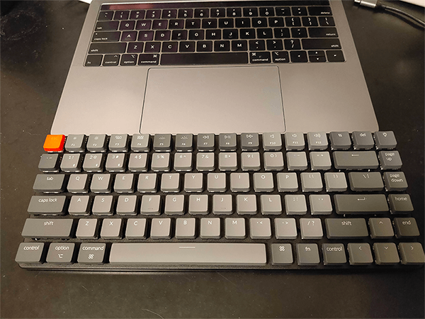
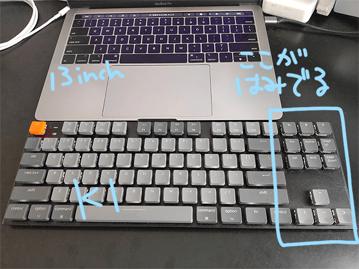

おしゃれデザインでお手頃価格のメカニカルキーボードを作っている
<a href="https://www.keychron.com/" target="_blank" rel="noopener noreferrer">Keychron</a>
というメーカーが結構好きで、
 
仕事用にKeychron K2, 自宅用にKeychron K1を持っているのですが、
 
新型のKeychron K3がKickstarterで先行販売していたので、K1から買い換えようと注文しました。

先日届いたので、どんな感じかお伝えしようと思います。

## 選んだモデル
スイッチはKeychron製のLow profile Optical Whiteのモデルにしました。

スイッチは選べる中で一番押下圧が軽いものにしてみました。
 
白スイッチは赤と同様のリニアタイプで、赤より更に軽いもののようです。

K1では赤を使っているので、ちょっと違うものにしてみようかなーという興味本位です。

## サイズ感
K1と比べるとやはりコンパクトで良いですね。

レイアウトはK2と同じです。
 
MacBookPro13インチと横幅が合っててスッキリ。

K1だと右側が長いのでちょっと邪魔だったんですよね。

あとかなり軽くて良いです。

サイズが小さいのもありますが、K1は表から裏までアルミ製のカバーで覆われているのに対して、
 
K3は上側だけがアルミで、裏はプラスチックになっているので、その影響が大きい気がします。

## 白軸どうよ？
使ってみた感想としては「めっちゃ柔らかい」ですね。
 
ちょっと押した感じが物足りないかもしれません。スッと底につく感じ。

力が全然いらないので、慣れたら優雅にタイピングができそうな気がします。

音はめっちゃ静かです。

K1(赤軸)とK3(白軸)でそれぞれ動画を撮ってみたのでどうぞ。

### K1(赤軸)
<iframe width="560" height="315" src="https://www.youtube.com/embed/9m_8VapfJEs" frameborder="0" allow="accelerometer; autoplay; clipboard-write; encrypted-media; gyroscope; picture-in-picture" allowfullscreen></iframe>

### K3(白軸)
<iframe width="560" height="315" src="https://www.youtube.com/embed/dw1s22Mii7M" frameborder="0" allow="accelerometer; autoplay; clipboard-write; encrypted-media; gyroscope; picture-in-picture" allowfullscreen></iframe>

## 総じて
いい感じなので引き続き使っていきたいと思います。

## 君もKeychronを手に入れよう
Keychronで買い物をすると他人に紹介する用のクーポンURLがもらえました。

こちらのリンクからサイトに飛ぶとKeychron製品が10%割引で購入できるらしいのでよろしければどうぞ。
 
http://keychronwireless.refr.cc/takakik

以上です。
