先日、AWS上で<a href="https://www.metabase.com/" target="_blank" rel="noopener noreferrer">Metabase</a>を構築しました。
<br/>

割と手間だったので、後の参考になればと思い、その手順を書いておきたいと思います。

## 最終的に作りたいもの

こんな感じのものを作ります。

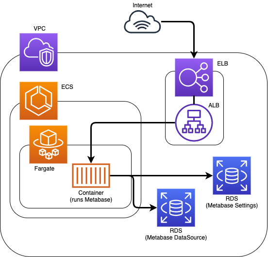

Metabaseのアプリケーションは、公式が出しているDockerイメージがあるので、Fargateで動かすことにします。
<br/>
単にDocker使ったほうが楽かなーというノリです。

Metabaseが使用するDBは2台になります。
<br/>
Metabase自体の設定を保存しておくものと、Metabaseで表示したいデータが入っているものです。
<br/>
（なお、Metabaseで表示したいデータが入っているDBは説明の中では作りません。適宜リードレプリカやスナップショットの復元などで準備してある状態を想定します。）

Metabaseを動かすコンテナはALBのターゲットグループに登録しておいて、インターネットからアクセスできるようにします。

全体的に1つのVPCに所属させることにします。

それではやっていきましょう。

## ECSクラスターを作る

ECS -> クラスター -> クラスターの作成 -> ネットワーキングのみ を選択して、次のステップをクリックします。

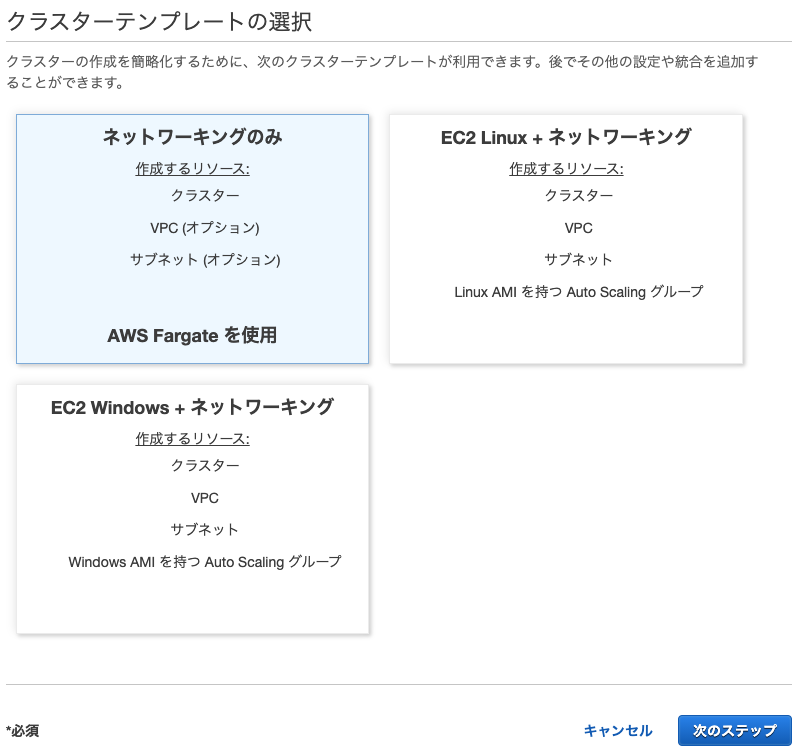

クラスター名は「metabase-cluster」としておきますかね。

「ネットワーキング」の項目では、「このクラスター用の新しい VPC を作成する」をチェックします。
<br/>
こうするとVPCが作られるので、後ほど作成していくリソースはこのVPCに入れていくようにします。

CIDRブロックを入力しますが、注意点としては、
<br/>
もしMetabaseで参照するDBが異なるVPCに所属している場合は、VPCピアリングを設定して通信できるようにする必要がありますが、
<br/>
CIDRブロックが同じだとVPCピアリングが設定できないので、かぶってない値にする必要があります。

VPCの設定は後から変えられない箇所があったりして、ミスってるとほぼ全部作り直すことになるので、よく確認しましょう。

---

今回は全部同じVPC内に入れていくつもりなので、適当にデフォルトで入っている値を使います。

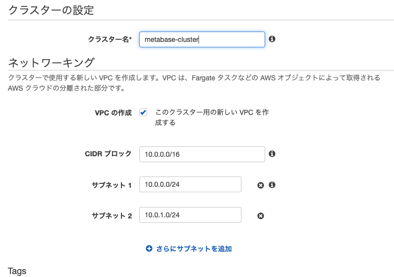

他のとこは適当で大丈夫でしょう。

「作成」をクリックすると、VPCなどのリソースが作成されます。

この後ECSのタスク定義が必要ですが、その前にDBとネットワーク周りを構築していきます。

## VPCの名前を変更する

分かりづらいので、先ほど作成されたVPCの名前を変更しておきましょう。

VPCの詳細から、タグの管理を開き、キー「Name」でタグを追加します。

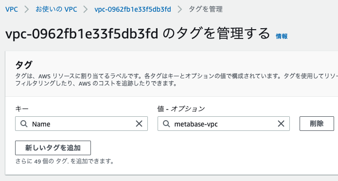

名前は「metabase-vpc」としておきます。

## Metabase設定保存用のDBを作成する

Metabase設定保存用にDBが必要なので、作っておきます。

RDSで「データベースの作成」をします。

PostgreSQL, MySQL, MariaDBが使えるようです。

https://www.metabase.com/docs/latest/operations-guide/configuring-application-database.html

今回はPostgreSQLを使うことにします。

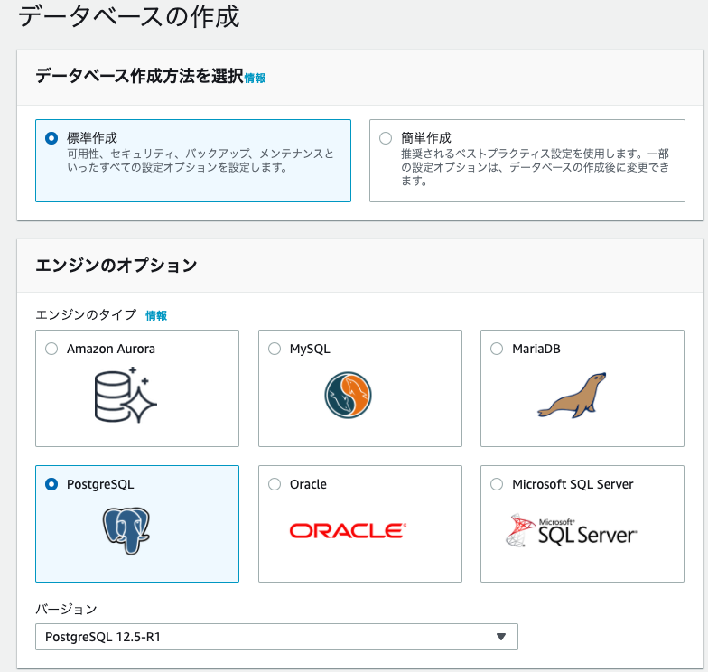

スペックは最低限(t3.micro, ストレージ 20GB) で大丈夫でしょう。

---

「接続」の項目で、VPCを、先ほど作った「metabase-vpc」にしておきます。

外部から接続する必要はないと思うので、パブリックアクセスは「なし」。

「VPCセキュリティーグループ」の項目では、「新規作成」を選択して、このRDSインスタンス用のセキュリティグループも新規作成しておきましょう。

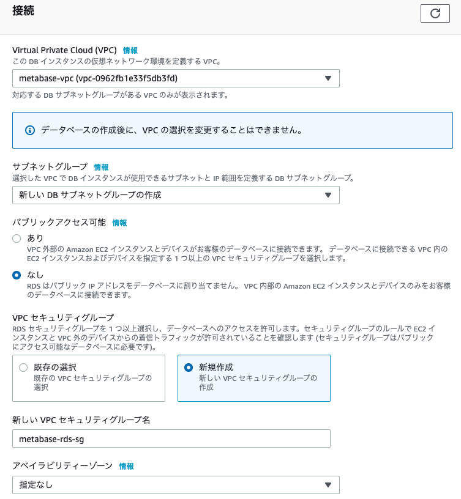

---

「追加設定」の項目で、インスタンスに作成するデータベース名を設定しておきます。
<br/>
「metabase」としておきます。

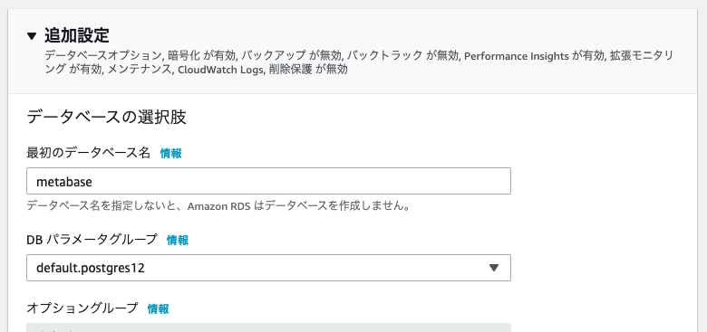

他のモニタリングなどの項目はお好みで設定して、作成します。

## ECS タスク定義の作成

ECSで動かすタスク定義を作成します。
<br/>
ECS -> タスク定義 -> 新しいタスク定義の作成 を開きます。

Fargateを選びます。

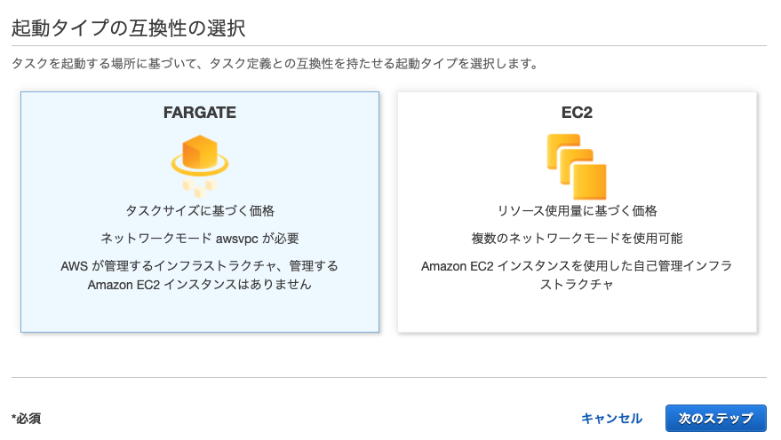

タスク定義名を入れます。「metabase-ecs-task」としておきます。

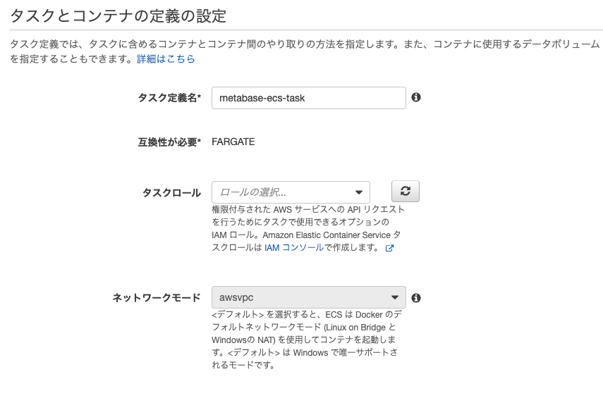

---

タスクサイズを選択します。適当です。後で足りなかったら増やしましょう。

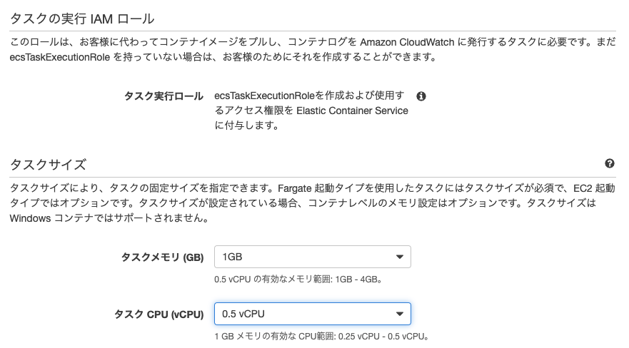

---

「コンテナを追加」ボタンをクリックすると、コンテナの設定画面が出てきます。
<br/>
コンテナ名を好きに付けます。「metabase」としておきます。
<br/>
イメージにはmetabaseのイメージ名を入れます。
<br/>
バージョンは指定してもいいですが、ここではlatestとしておきます。`metabase/metabase:latest`となります。

ポートマッピングで、TCP 3000 を設定しておきます。metabaseのイメージが3000番でリッスンするようになっているためです。

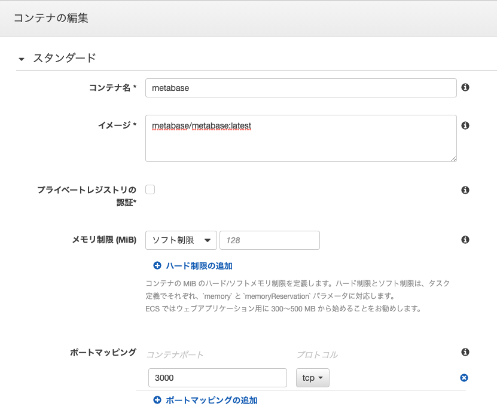

下にスクロールすると、「詳細コンテナ設定」があります。

ヘルスチェックのところは空欄でいいです。

環境のところは、環境変数を入れる必要があります。

以下の名称の環境変数を、先ほど作ったMetabase設定保存用のDBの情報に応じて入れておきます。

- MB\_DB\_TYPE
- MB\_DB\_DBNAME
- MB\_DB\_PORT
- MB\_DB\_USER
- MB\_DB\_PASS
- MB\_DB\_HOST

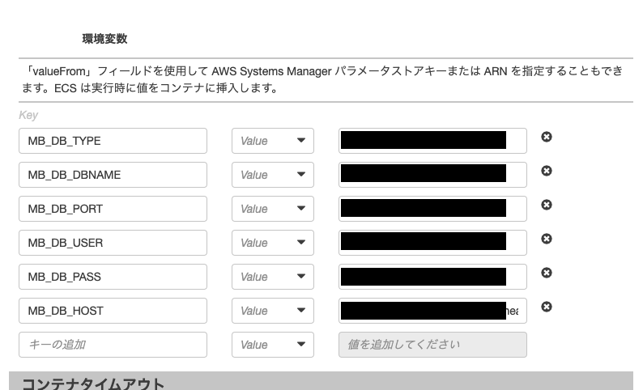

コンテナタイムアウト、ネットワーク設定は入れなくて良いです。

---

ストレージとログ のところは、「ログ設定」「Auto-configure CloudWatch Logs」にチェックしておくと、CloudWatch Logsの設定をやってくれます。

コンテナ内のログはCloudWatch Logsに書き出すなどしないと見れないので、やっておきましょう。

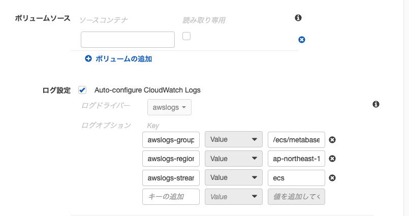

リソースの制限、DOCKER ラベル は入れなくて良いです。

追加を押します。追加されてますね。

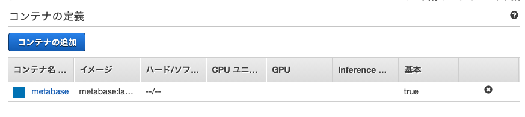

---

プロキシ設定、ログルーターの統合、ボリューム、Tags は入れなくていいです。

作成をクリックします。

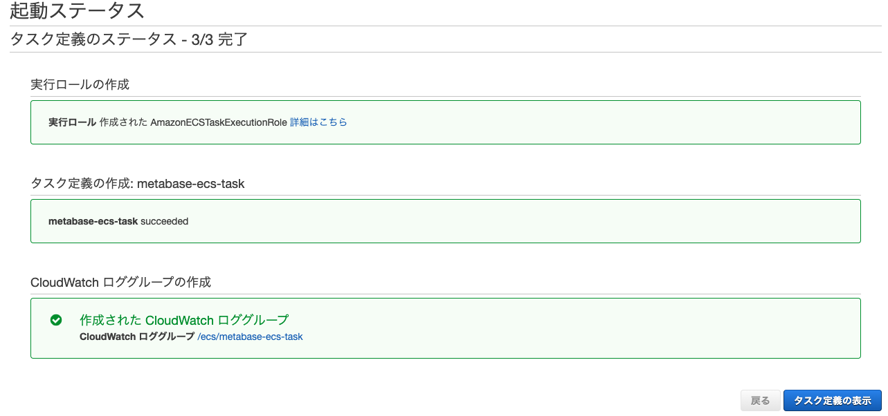

タスク定義作成完了です。ECS実行ロールやCloudWatch ロググループも一緒に作成されています。


## ロードバランサー(ALB) 作成

インターネットからECS(Metabase)にアクセスできるように、ロードバランサーを作ります。

EC2 -> ロードバランサー -> ロードバランサーの作成を開き、Application Load Balancer の作成をクリックします。

名前は好きに付けていいです。ここでは「metabase-lb」にしておきます。
<br/>
スキームは「インターネット向け」、IPアドレスタイプは「ipv4」にしておきます。


リスナーは、とりあえずHTTP, ポート80 だけにしておきますが、ちゃんとするならHTTPSを追加しておくといいでしょう。

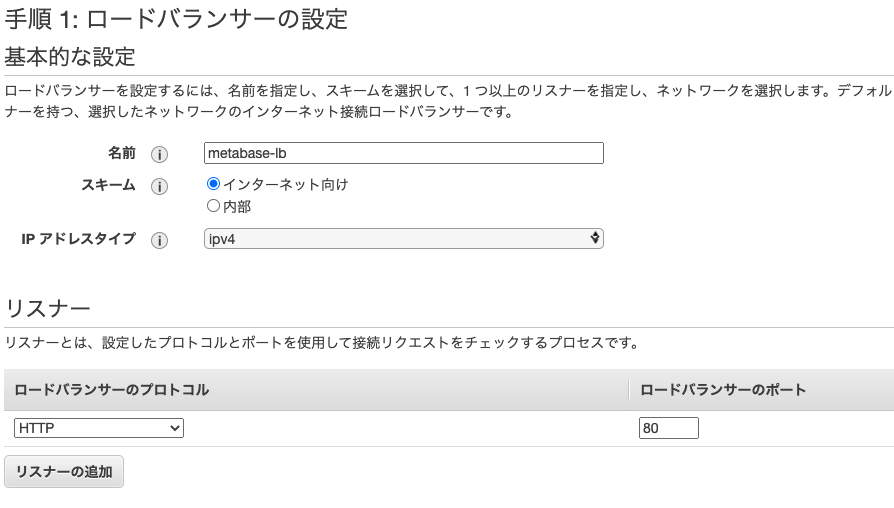

アベイラビリティーゾーンの項目では、VPCに「metabase-vpc」(最初の方で作成したもの)を選択します。

アベイラビリティーゾーンのチェックボックスが2つ出るので、2つともチェックしておきます。

アドオンサービス、タグはお好みで設定してください。しなくていいです。

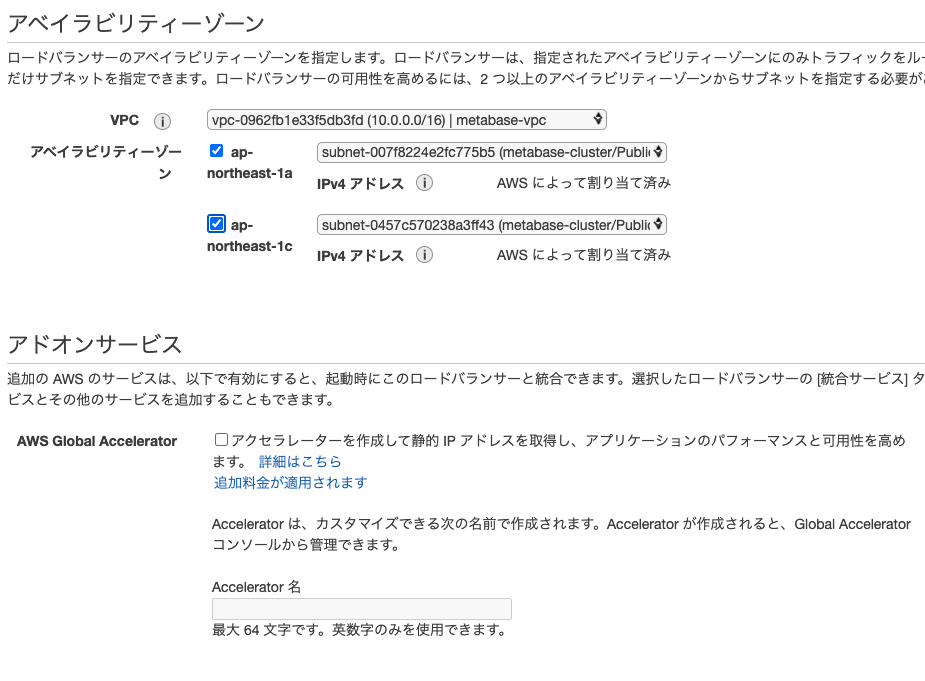

---

次のページに進むとHTTPSのリスナーを追加していないので怒られてしまいました。気にせずこのまま勧めます。
<br/>
HTTPSのリスナーがあれば、証明書の設定などが出てくるはずです。

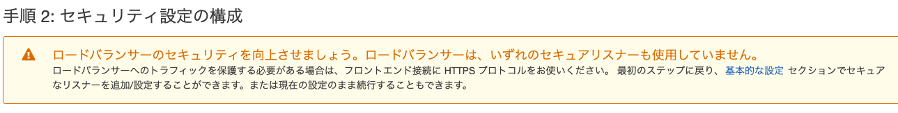

---

セキュリティーグループの設定です。ALBに設定する用のセキュリティーグループを新しく作ります。

「新しいセキュリティグループを作成する」を選択して、セキュリティーグループ名と説明をお好みで入れます。
<br/>
名前は「metabase-lb-sg」としておきます。

設定内容は、HTTP(TCP 80)でリッスンしますので、プロトコル: TCP, ポート範囲: 80のルールを作っておきます。
<br/>
HTTPSのリスナーを追加していれば443も作ります。

ソースにはアクセスを許可するCIDRブロックを記述します。

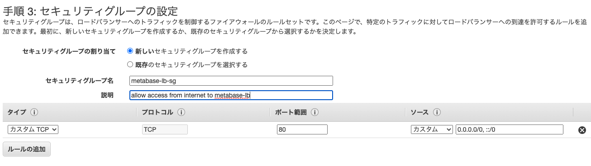

画像だと、`0.0.0.0/0, ::/0`なので、全部許可になります。かなりザルです。
<br/>
Metabaseの画面は一般公開したいようなものではないと思うので、実際にはIPアドレス等で制限かけるべきです。

---

次はターゲットグループの作成です。

「新しいターゲットグループ」を選択して、名前を入れます。

ターゲットの種類は「IP」、プロトコルは「HTTP」、ポートは「80」にしておきます。

その他のところはそのままでいいです。

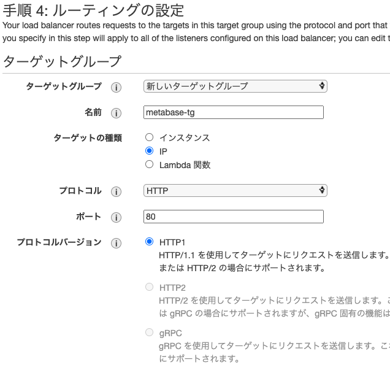

---

次はターゲットの登録ですが、ここはECSが自動でやってくれるところなので、何もせず次に行きます。

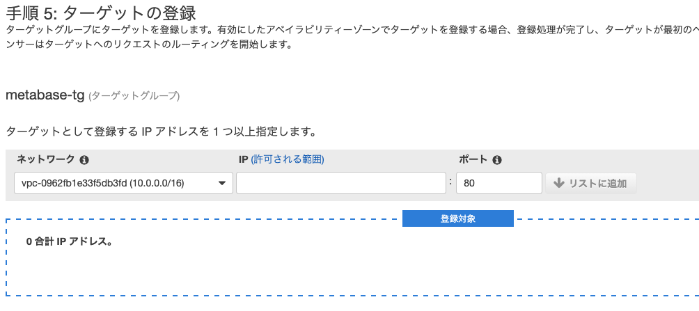

確認画面で、「作成」をクリックしたら作成されます。

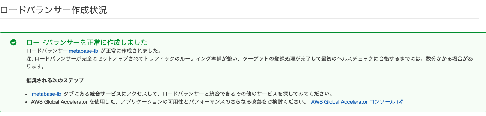

## ECS サービスを作成

ECS上でサービスを起動していきます。

ECS -> クラスター → metabase-cluster を開き、「サービス」タブの「作成」ボタンをクリックします。

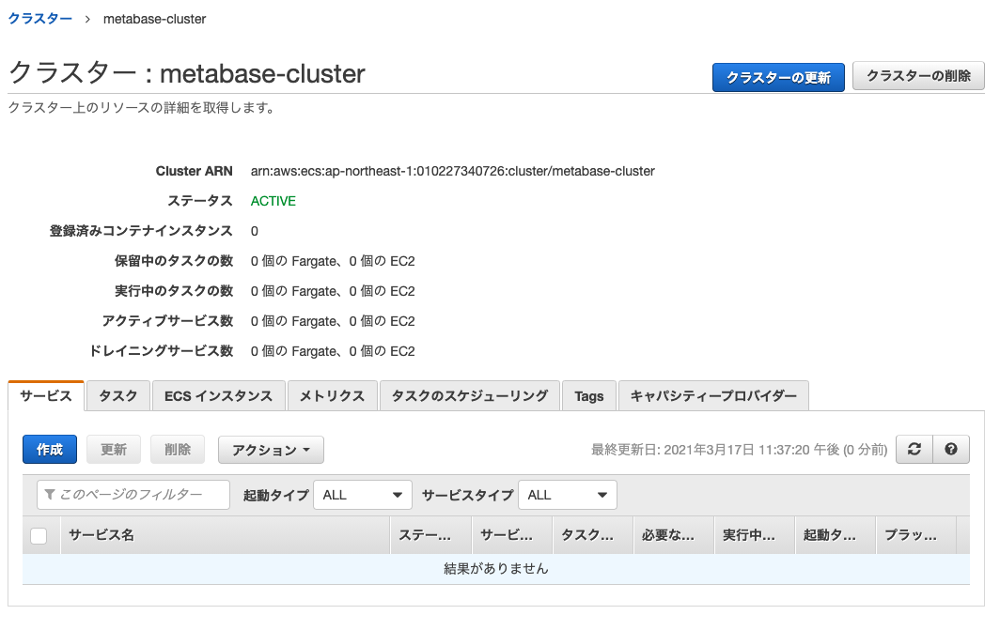

起動タイプは「FARGATE」を選択します。

タスク定義は、先ほど作成したタスク定義(metabase-ecs-task)を選択します。

クラスターは、先ほど作成したクラスター(metabase-cluster)を選択します。

サービス名は好きな名前つけておきます。「metabase」としておきます。

タスクの数は「1」にしておきます。

他のところはデフォルトのままで大丈夫です。

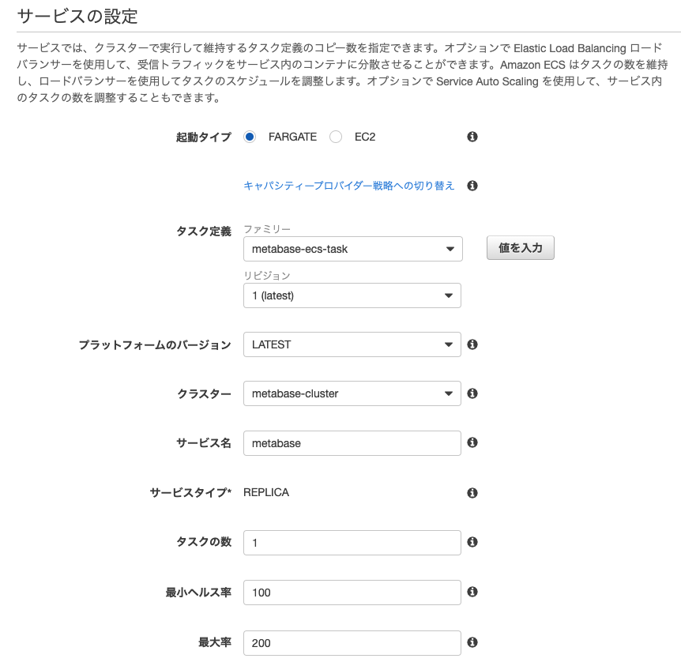

---

続いてネットワーク構成の設定です。

クラスター VPCには、先に作成したVPC(metabase-vpc)を選択します。
<br/>
サブネットにはプルダウンの選択肢が2つ出てくるので両方クリックしておきます。

セキュリティーグループの設定のため、編集ボタンをクリックします。

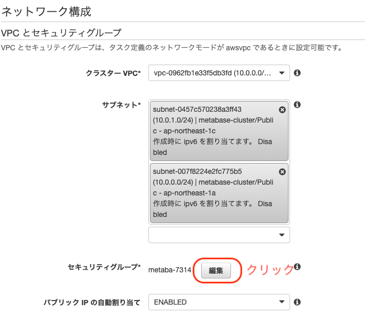

---

セキュリティーグループの設定画面が出てきます。

「新しいセキュリティーグループの作成」を選択して、名前を入れます。「metabase-cluster-sg」としておきます。

インバウンドルールに、TCP 3000、ALB用のセキュリティーグループ(metabase-lb-sg)からの通信を追加します。

ソースにセキュリティーグループを指定するには、「ソースグループ」を選択して、プルダウンからセキュリティーグループを選択します。
<br/>
が、セキュリティーグループ名が表示される幅が狭すぎて名前が見えないので、セキュリティーグループIDで判別して選びましょう。

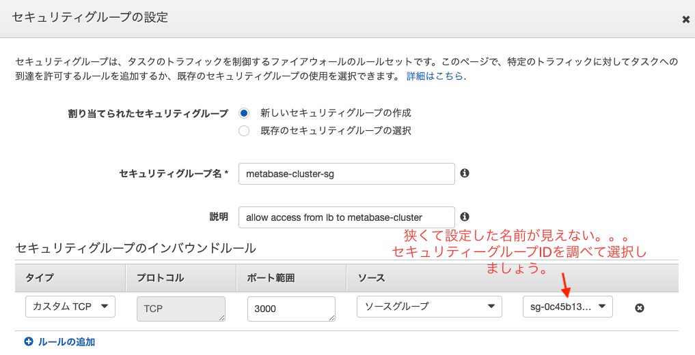

---

次にロードバランシングの設定です。

ロードバランサーの種類に「Application Load Balancer」を選択します。

そうすると「ヘルスチェックの猶予期間」の項目が入力できるようになるので、数値(秒数)を入れます。
<br/>
最初の起動時に少し時間がかかるので、長めに600秒としておきます。

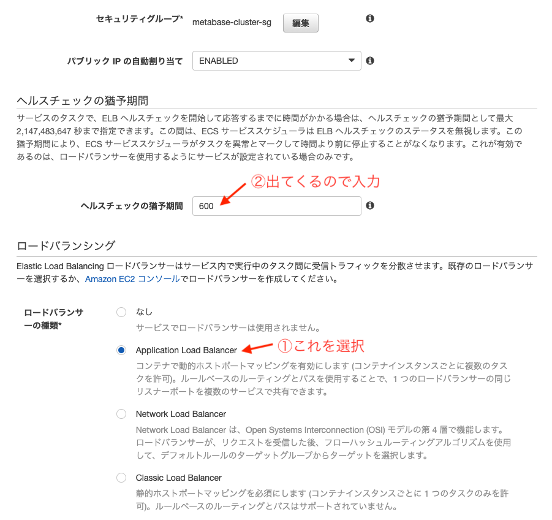

---

「ロードバランサー名」のところは先に作成したALB(metabase-lb)を選択します。

「コンテナの選択」に、先に定義済みのコンテナ(metabase)が表示されているはずなので「ロードバランサーに追加」をクリックします。


コンテナの設定項目が出てきます。

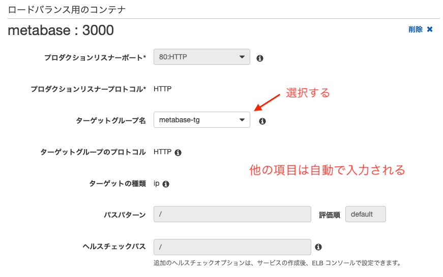

「ターゲットグループ名」の項目に先に作成したALB(metabase-lb)を選択します。
<br/>
すると、他の項目は自動で入力されます。

---

次の画面ではAuto Scalingの設定が出ますが、特に変更しなくて大丈夫です。

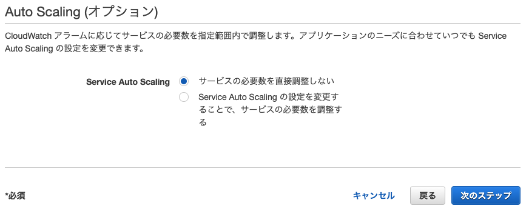

次に進むと確認画面がでるので、「サービスの作成」をクリックすれば完了です。

---

以上でサービスが起動し始めますが、このままだと起動に失敗→再度起動→再度失敗 のループになります。
<br/>
なぜかというと、ECSクラスター(metabase-cluster)からMetabase設定用のDBへのアクセスを許可していないためです。

ちなみにCloudWatch Logsにログが出ているはずなので、中身を見てみると

```
ERROR metabase.core :: Metabase Initialization FAILED
```

```
clojure.lang.ExceptionInfo: Unable to connect to Metabase postgres DB.
```
というようなエラーが出ていますね。

---

RDS用のセキュリティーグループを編集します。

インバウンドルールにTCP 5432 (Postgresのリッスンポート) を入れて、
<br/>
ソースは「カスタム」を選択して、対象として先に作成したクラスター用セキュリティーグループ(metabase-cluster-sg)を選択します。

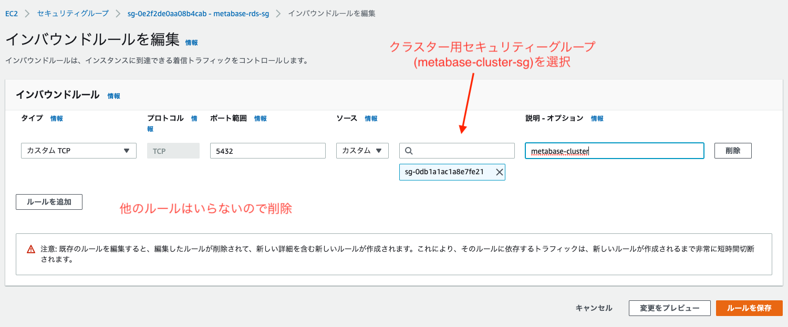

他にインバウンドルールがあれば不要なので削除しておきます。

---

これでOKなはずです。

ALBのDNS名にアクセスすると、Metabaseの初期設定画面が出ます。

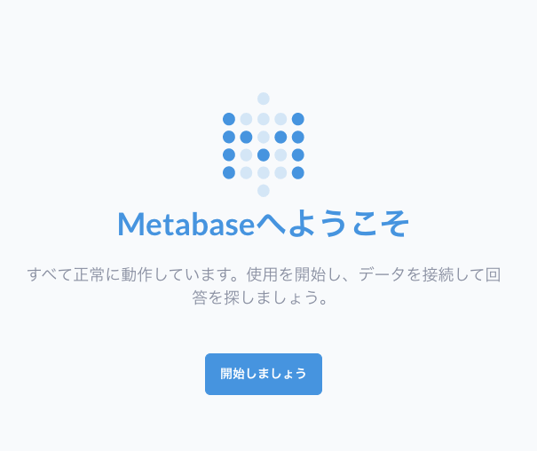

後は画面に従ってセットアップをやっていけばOKです。

---

## 他に必要なこと

他にも作業あるので、適宜やりましょう。

### データソースにアクセスできるようにしておく

Metabaseで表示したいデータを保存しているDBは、ECSクラスターからアクセスできる状態にしておく必要があります。
<br/>
（セキュリティーグループのルール追加とか、VPCが違うならVPCピアリングしたりだとか）

### ドメインに紐付ける

特定のドメイン名でMetabaseアクセスできるようにしたい場合は、Route53にレコードを追加します。
<br/>
CNAMEでALBのDNS名に対応させればできるはずです。

---

以上です。お疲れさまでした。
