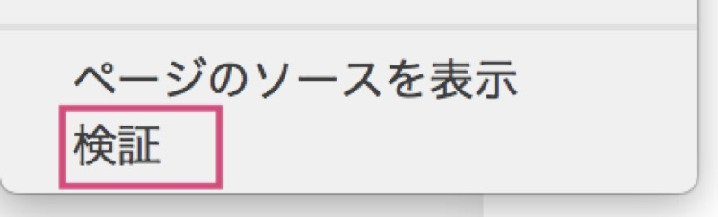
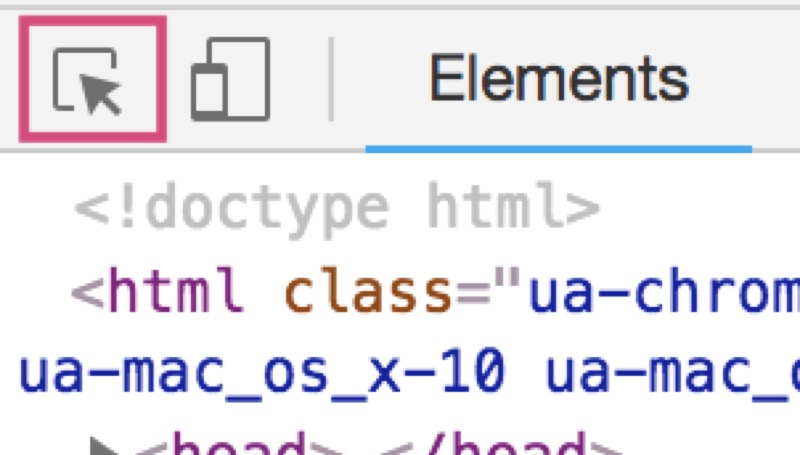
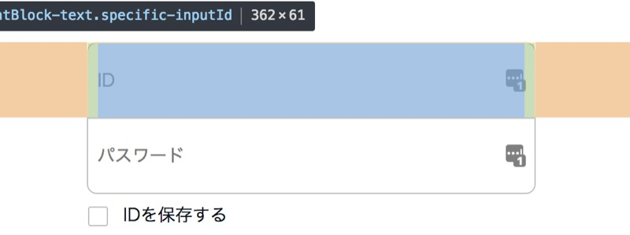
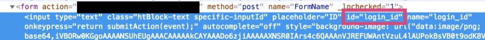
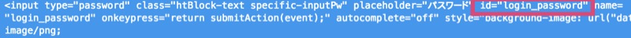
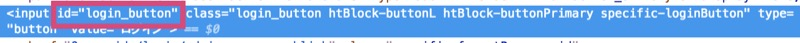

こんにちは！

今回はSeleniumとBeautifulSoupを使って、
<br/>
ログインが必要なページのデータを抜き出してcsvに出力するプログラムを作りながら、それぞれの使い方を解説していきます。

MacでPython3の実行環境が整っている前提で書きます。

## 背景

先日、会社の事務作業の都合で、自分の勤怠情報をいい感じに整形したcsvファイルにしたいな〜
<br/>
という場面がありました。

勤怠管理システムからデータを出力して、整形するスクリプトを作ればいいかなと思ったのですが、
<br/>
弊社で利用しているシステムではデータ出力形式がpdfか、(作り込まれた)Excelファイルしかできないみたいで？
<br/>
出力した後の加工が難しそうでした。

シンプルなcsvで出力してくれればいいのにー。
<br/>
無いなら、作ればばいい、ですね。

## やりたいこと

ざっくり以下のような機能を実装すればいい感じです。

- ログインページにアクセス
- ログインページからログイン
- ログイン後ページからhtmlを抜き出し
- 抜き出したhtmlから必要なデータを抜き出し
- csvファイルに書き込む

## Seleniumとは

SeleniumはWebブラウザの操作を自動化できるソフトウェアです。

実行すると、ブラウザが起動して、記述したスクリプトの通りに自動でブラウザを操作してくれます。
<br/>
フォームに入力したり、ボタンをクリックしたり、人間がブラウザを操作するのと同じようにできます。
<br/>
やばいですよね。

対応している言語はいくつかありますが、今回はPythonを使ってみます。

### Seleniumのインストール(Python用)

pipでインストールできます。
```
pip3 install selenium
```

合わせてブラウザを動作させるためのWebDriverを用意しておく必要があります。

今回はChromeを使おうと思うので、このページからchromedriverをダウンロードして、実行可能なパスに配置しておきます。
<a href="https://sites.google.com/a/chromium.org/chromedriver/downloads" target="_blank" rel="noopener noreferrer">ChromeDriver – WebDriver for Chrome</a>

`/usr/local/bin`あたりに置いておけばOKです。

各ブラウザに対応するドライバーの入手先はSelenium公式ページにまとまっています。
<a href="https://www.seleniumhq.org/download/" target="_blank" rel="noopener noreferrer">Downloads – Selenium</a>

## BeautifulSoupとは

BeautifulSoupはhtmlを解析して各要素をPythonのオブジェクトとして扱えるようにしてくれるライブラリです。
<br/>
変な名前ですね。

わかりやすく言うと、Webページに表示されるデータをプログラムの中で扱いやすい形に変換してくれるやーつです。

### BeautifulSoupのインストール

pipでインストールできます。

```
pip3 install beautifulsoup4
```

## Seleniumでログインページからログインする

じゃあやっていきましょう。

### 操作する画面の要素を調べる

まずはターゲットとするサイトのhtmlを分析しておきましょう。

Seleniumでブラウザを操作するためには、ページのhtmlの要素を具体的にどれ、
<br/>
と指定する必要があるため、実際のページでどのように出力されているかを事前に調べます。

ログインするためには、
- 入力フォームに文字を入力する
- ログインボタンを押す

という操作をしますので、これらの要素がhtmlでどのように記述されているか見てみます。

Chromeを使っている場合の手順を書きます。

ログインしたいページを開き、画面の適当なところを右クリックし「検証」をクリックします。


デベロッパーツールが開くので、メニューバーの一番左のアイコンをクリックします。


続けてページ上の調べたい要素をクリックします。


まずはユーザーIDの入力欄をクリックしてみます。


該当するhtmlの箇所が展開されハイライトされます。
<br/>
input要素のid属性に`login_id`が設定されていることが分かりました。
<br/>
htmlの規約上、id属性の値は全ての要素の中で一意に設定されているはずなので、
<br/>
これを使ってSeleniumを操作できそうです。

同様に、パスワード入力欄とログインボタンも見てみます。
<br/>
それぞれ、id属性に`login_password`, `login_button`が設定されていました。



### ログインするコード

ではコードを書いていきましょう。

Seleniumを使うには、以下をimportしておく必要があります。

```python
from selenium import webdriver
from selenium.webdriver.common.keys import Keys
```

その後、webdriverのインスタンスを作成します。

```python
driver = webdriver.Chrome()
driver.implicitly_wait(3)
```

webdriverのメソッドを実行することで、ブラウザを操作することができます。

`implicitly_wait()`は、画面に要素がロードされるまで待つ秒数を設定する関数です。
<br/>
ページを開いた直後には指定したい要素が読み込まれないことがありますので、
<br/>
適当に3秒くらい入れておくことにしましょう。

続いて、ログインページを開いて、ログインするところを書いていきます。

```python
url = "https://example.com/login/"
user = "username"
password = "password"
driver.get(url)
elem = driver.find_element_by_id("login_id")
elem.clear()
elem.send_keys(user)
elem = driver.find_element_by_id("login_password")
elem.clear()
elem.send_keys(password)
elem = driver.find_element_by_id("login_button")
elem.click()
```

`get()`に開きたいページのURLを入れて、ページを開きます。

`find_element_by_id()`は、ページの中の要素をid属性の値で指定するメソッドです。
<br/>
戻り値で取れるオブジェクトのメソッドを実行することで、その要素に対して操作を行うことができます。

先ほど調べたid属性の値を入れて、入力欄の要素を取得します。

```python
elem.clear()
```
`clear()`は、入力欄に入っている値をクリアします。
<br/>
サイトによっては自動的に値が入力されてる場合があるので、念のためクリアしておきます。

```python
elem.send_keys()
```

`send_keys()`は、入力欄にキーボード入力を送信します。
<br/>
引数に文字列を入れることで、要素を選択した状態で、キーボードで文字を入力する操作になります。


```python
elem.click()
```

`click()`は、要素をクリックします。

コードの全体はこんな感じです。
```python
from selenium import webdriver
from selenium.webdriver.common.keys import Keys

url = "https://example.com/login/"
user = "username"
password = "password"

driver = webdriver.Chrome()
driver.implicitly_wait(3)

driver.get(url)

elem = driver.find_element_by_id("login_id")
elem.clear()
elem.send_keys(user)

elem = driver.find_element_by_id("login_password")
elem.clear()
elem.send_keys(password)

elem = driver.find_element_by_id("login_button")
elem.click()
```

ユーザーID入力欄、パスワード入力欄、ログインボタンを順に操作することで、ログインするようにコードを書いてみました。

実行してみましょう。

```
python login_example.py
```

ブラウザが起動して、自動でユーザーIDとパスワードが入力され、ログインができましたね。
<br/>
おめでとうございます。

## BeautifulSoupでデータを抜き出す

続いて、ログイン後のページからデータを抜き出すところを書いていきます。

以下のようにしてBeautifulSoupにページのソースを読み込ませます。

```python
page_source = driver.page_source
soup = BeautifulSoup(page_source, 'html.parser')
```

WebDriverインスタンスのpage_sourceに開いているページのソースが入っているので、
<br/>
それをBeautifulSoupに渡してオブジェクトを作成しています。

### BeautifulSoupの使い方

詳しくは
<a href="http://kondou.com/BS4/" target="_blank" rel="noopener noreferrer">日本語ドキュメント</a>
もあるので、
<br/>
それ読んでね、って話なんですが、
よく使いそうだな、という点だけ説明します。

BeautifulSoupでやることをざっくり言うと、「htmlの要素を選択して、中の文字列を取る」の繰り返しです。

#### 要素を選択する

BeautifulSoupのインスタンスのメソッドを実行して、htmlの要素をオブジェクトとして取り出します。

使えるメソッドはいろいろあるんですが、以下を使っとけば大体いい感じにできます。
```python
.find()
```

```python
.find_all()
```

それぞれ、引数に要素を検索する条件をいれて使います。

`find()`では、最初にマッチした要素が1つ取得できます。
<br/>
`find_all()`では、全体を検索してマッチした要素の全てを、配列として取得できます。

#### よく使う選択方法

##### 要素名で選択する

引数に要素名を文字列で入れてやります。

```python
table = soup.find("table")
# 最初にマッチしたtable要素が取得できる
```

##### idで選択する

`id=""`という形でキーワード引数を渡してやります。

例えばこんな感じのhtmlだったとして、
```html
<div>
  <div id="a-gyo">あいうえお</div>
  <div id="ka-gyo">かきくけこ</div>
</div>
```

「あいうえお」が入った要素を取得するには

```python
div_a_gyo = soup.find(id="a-gyo")
```

とやります。

##### classで選択する

`class_=""`という形でキーワード引数を渡してやります。

例えばこんな感じのhtmlだったとして、
```html
<div>
  <div class="alphabet">abcde</div>
  <div class="hiragana">あいうえお</div>
</div>
```

「あいうえお」が入った要素を取得するには

```python
div_hiragana = soup.find(class_="hiragana")
```

とやります。

##### 任意の属性で選択する

サイトによっては`data-`から始まる独自の属性が付与されていることがあります。
<br/>
そのような属性で選択したい場合は、attrsキーワード引数に辞書を渡してやります。

こんな感じ。

```python
attrs={"attribute" : "value"}
```

例えばこんな感じのhtmlだったとして、
```html
<div>
  <div data-some-attr="alphabet">abcde</div>
  <div data-some-attr="hiragana">あいうえお</div>
</div>
```

「あいうえお」が入った要素を取得するには

```python
div_hiragana = soup.find(attrs={"data-some-attr" : "hiragana"})
```

とやります。

##### 要素の中の文字列を取得する

要素オブジェクトのtextで取得できます。

こんな感じ

```python
td = soup.find("table").find("tr").find("td")
print(td.text)
```

ただ、スペースや改行が入ってしまうので、続けて`.strip()`を実行するといい感じです。

```python
print(td.text)
# 前後に改行やスペースが入ってしまう
print(td.text.strip())
# いい感じに文字だけになる
```

##### メソッドチェーン

`find()`で取得できる要素のオブジェクトは、続けて`find()`とか`find_all()`を実行することができます。

```python
tds = soup.find("table").find("tr").find_all("td")
# 最初にマッチしたtable要素の中の最初のtr要素の中のtdを全部取る
```

##### いらない要素を削除する

例えばこんな感じのhtmlがある時

```html
<div>
  <div class="hiduke">
    2018/12/09<span>(日)</span>
    <span>★</span>
  </div>
</div>
```

`"2018/12/09"`の文字だけほしいな、という場合は、削除したい要素を選択して`extract()`を実行します。

```python
div_hiduke = soup.find(class_="hiduke")
print(div_hiduke.text.strip())
# =>(日)と★がはいってきてしまう

# 中にあるspan要素をまとめて取って、
spans = div_hiduke.find_all("span")
# for文でextract()を実行
for span in spans:
    span.extract()

print(div_hiduke.text.strip())
# =>いい感じになる
```

##### CSSセレクタ

select()を使うと、CSSセレクタでも要素を取得できるんですが、
<br/>
開始タグ、終了タグを含んだ文字列のリストになってしまうのでBeautifulSoupのメソッドが使えず、
<br/>
いまいち使いづらいです。

html例
```html
<div class="user-name">
  山田太郎<span>さん</span>
</div>
```

こんな感じの動きになります。
```python
# class="user-name"の要素の中にあるspan要素を取得
span = soup.select(".user-name span")
print(span.text)
# => .textはできない

print(span)
# => 開始タグ、終了タグが入った文字列になる
# [<span>さん</span>]
```

## CSVに書き出す

続いてBeautifulSoupで取り出した文字列を、ファイルに書き出していきましょう。

まずは出力するファイルのパスを決めましょう。

こんな感じにすると、実行するPythonファイルと同じ場所に、`out.csv`というファイル名で書き出します。

```python
import os

# 実行ファイルの絶対パスを取得し、そのファイルパスのディレクトリパスを取得する
output_dir = os.path.dirname(os.path.abspath(__file__))
file_name = "out.csv"
# output_dirとfile_nameを結合したパスを作成する
output_file = os.path.join(output_dir, file_name)

# 出力ファイルをオープンする
with open(output_file, mode='w', encoding='shift_jis') as f:
  # ...
```

`encoding`はお好みで。

`with`ブロックの中で、BeautifulSoupを使って文字を取得し、ファイルに書き込んでいきます。

例えばテーブルがあって、その中の2列目、4列目、5列目のデータをカンマ区切りで出力したいとしましょう。
<br/>
こんな感じに書けばいいんじゃないでしょうか。

```python
with open(output_file, mode='w', encoding='shift_jis') as f:
    # table > tbodyにあるtrを全て取得
    rows = soup.find("table").find("tbody").find_all("tr")
        for row in rows:
            # 1つのtrの中にあるtdを全部取得
            datas = row.find_all("td")
            # 2番目のtd
            f.write(datas[1].text.strip())
            f.write(',')
            # 4番目のtd
            f.write(datas[3].text.strip())
            f.write(',')
            # 5番目のtd
            f.write(datas[4].text.strip())
            # 改行
            f.write('\r\n')
```

## 完成品がこちら

これまで書いてきたようなことを組み合わせて、作ったものがこちらです。
<br/>
参考にしてみてください。

<a href="https://github.com/KobayashiTakaki/CreateCsvForSomeSystem" target="_blank" rel="noopener noreferrer">https://github.com/KobayashiTakaki/CreateCsvForSomeSystem</a>

以上です。お疲れ様でした。

皆様もダルい業務があるなら、ぜひ作ってみてください。
<br/>
ダルい業務はどんどん自動化しましょう。

@弊社メンバー
<br/>
某システムの取込データ作成なう。に使っていいよ

## 参考

<a href="https://selenium-python.readthedocs.io/index.html" target="_blank" rel="noopener noreferrer">Python用Seleniumの使い方をまとめたページ</a>
<br/>
<a href="https://kurozumi.github.io/selenium-python/index.html" target="_blank" rel="noopener noreferrer">Python用Seleniumの使い方をまとめたページの日本語訳版</a>
<br/>
<a href="https://www.crummy.com/software/BeautifulSoup/bs4/doc/" target="_blank" rel="noopener noreferrer">BeautifulSoup4の公式ドキュメント</a>
<br/>
<a href="http://kondou.com/BS4/" target="_blank" rel="noopener noreferrer">BeautifulSoup4の公式ドキュメントの日本語訳版</a>
