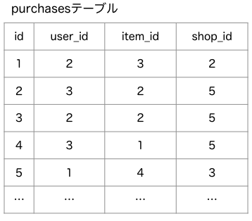

こんにちはー。

SQL書いてますか？私は書いてます。

この記事では、「SQLよくわからんよー」な人向けに、SQLの文法の中でもわかりにくい、`EXISTS`の使い方について、できるだけわかりやすく説明したいと思います。

## まずはサンプル

`EXISTS`を使ったSQLの例を書いてみます。

```sql
select
  *
from
  users
where
  exists (
    select
      1
    from
      purchases
    where
      purchases.user_id = users.id
      and purchases.item_id = 2
      and purchases.shop_id = 5
  )
;
```

はい。
<br/>
ユーザーが商品を購入するとpurchasesテーブルにレコードが作られて、
<br/>
purchaseテーブルの `user_id`にはユーザーのID, `item_id`には商品ID, `shop_id`には店舗IDが入る
<br/>
という状況をイメージしたSQLです。
<br/>
これで商品ID: 2の商品を、店舗ID: 5の店舗で購入したユーザーを取得できることになります。

SQLに慣れていないとマジ意味わからんとなりますよね。その気持ち分かります。

これからこのSQLが理解できるように説明していきたいと思います。

## EXISTSの動きのイメージ

`EXISTS`の動作をざっくり説明すると、

> 「このレコードの値を使って検索したら、レコードはあるかな…？あったらOK」

という感じです。

先ほどのSQLを図を使って説明してみます。

まずは取得したいデータが入っている大元の、usersテーブルがありますね。


で、別のところにpurchasesテーブルがあります。



usersテーブルに対して`where exists`とやると、usersテーブルのレコード1件1件に対して、
<br/>
「このレコードの値を使って検索したら、レコードはあるかな…？あったらOK」
<br/>
の判定を行うことになります。

今データを取ろうとしているusersテーブルから一旦離れて、別のテーブルを見に行く感じです。

先に出したSQLでいうと、
<br/>

「purchasesテーブルの中に、usersテーブルのidとuser\_id が一致していて、`item_id = 2`で`shop_id = 5`のレコードはあるかな？」

<br/>
を判定することになります。


例えば、usersテーブルの`id = 3`のレコードについては、
<br/>
「`user_id = 3`で、`item_id = 2`で`shop_id = 5`のレコードはあるかな？」となります。

一致するレコードがあれば、そのusersテーブルのレコードは残され、無ければ除外されます。

その結果、条件に一致して残ったレコードがSQLの結果として取得されるという訳です。


## SQLの意味をもう少し詳しく

判定の条件を`exists`の後の`()`の中に書きます。

判定の条件の書き方は、SQLのSELECT文と同じ書き方で書きます。

```sql
select
  1
from
  purchases
where
  purchases.user_id = users.id
  and purchases.item_id = 2
  and purchases.shop_id = 5
```

この部分だけ抜き出してみると、普通にselectするときとは少し変わった形になっています。

まずは、`select 1`となっているのはなぜか？と気になるかもしれません。

これは、「selectする値はなんでもいいので、とりあえず1を入れただけ」です。

SELECT文の文法では、`select`の後ろに何かしらを指定しないといけないんですが、
<br/>
これはレコードがあるかどうかの判定に使いたいだけなので、SELECTした結果の値は別に使いません。

なので、`1`でも`id`でも`'hogehoge'`でも何を書いてもいいです。
<br/>
個人的にはいつも`1`を書いてます。

あとは、ここがあんまり見ない形ですね。

```sql
purchases.user_id = users.id
```

このSQLは、`from purchases`となっているので、purchasesテーブルを検索する条件が書いてあるはずです。

`purchases.user_id`の部分はまあいいですよね。
<br/>
そのまま、取得しようとしているpurchasesテーブルの`user_id`カラムを比較しますよーということです。

で、もう一方の`users.id`については、先ほどusersテーブルの1件1件に対して、「このレコードはあるかな？」を判定すると書きましたが、
その比較をするときの1件ごとの`users.id`が入る感じです。

なので、usersテーブルに例えば`id = 1`, `id = 2`, `id = 3`のレコードがあれば、
<br/>
`purchases.user_id = 1`, `purchases.user_id = 3`, `purchases.user_id = 3`
<br/>
とそれぞれの値を入れた条件で検索する形になります。
<br/>
（あくまで内部の動きのイメージですよ）

残りの条件も合わせると、例えばusersテーブルの`id = 1`のレコードについて判定するときは、

```sql
where
  purchases.user_id = 1
  and purchases.item_id = 2
  and purchases.shop_id = 5
```

という形になって、purchasesテーブルを検索する条件になりますね。

usersテーブルに実際にどんな値が入っているかはわからないので、
<br/>
`purchases.user_id = users.id`と書くことで、全部のレコードをまとめて指定する感じの意味合いになります。

## 他のSQLの例

他にもありそうなSQLの例を書いて説明してみます。

```sql
select
  *
from
  authors
where
  exists (
    select
      1
    from
      articles
    where
      articles.author_id = authors.id
      and articles.category = 'cat'
  )
;
```

はい。よくある著者と記事の関係ですね。

`exists`の中で、`articles`テーブルを見に行ってます。
<br/>
カテゴリー: 猫の記事を書いた著者が取得できるんでしょうね。

続いては`not exists`を書いてみます。

```sql
select
  *
from
  users
where
  not exists (
    select
      1
    from
      gate_logs.user_id = users.id
      and gate_logs.room_id = 7
      and gate_logs.direction = 'in'
  )
;
```

妄想ですが、部屋に入退室を記録する装置があって、`gate_logs`テーブルに人のID, 部屋のID, 入退室の方向が記録されていくみたいな状況を想定したSQLです。

`not exists`なので、「なかったらOK, あったらNG」です。
<br/>
`not exists`の中の条件は、「部屋ID: 7」で、「方向が入室」のログを検索するようになっているので、つまりはID: 7の部屋に入った記録が無いユーザが取得されることになります。

ところで、`EXISTS`と同じような結果を取得するのに、`JOIN`を使うこともできます。
<br/>
が、`EXISTS`を使えるのであれば`EXISTS`でやったほうがパフォーマンスが良いことが多いです。

```sql
select
  *
from
  users
  left join
  gate_logs
    on
      gate_logs.user_id = users.id
      and gate_logs.room_id = 7
      and gate_logs.direction = 'in'
where
  gate_logs.user_id = null
;
```

「部屋ID: 7」で、「方向が入室」のログをusersに`left join`して、joinされるgate_logsのレコードが無いユーザーを取得しようということですね。結果としては同じユーザが取れるはずです。

しかし、妄想ですが、usersもgate_logsもレコード数が多そうなので、`left join`なんかしてしまうとかなり重そうです。
<br/>
joinした値を使う必要がない、存在の有無を判定したいような箇所では、`EXISTS`を使うようにしたほうがスマートですね。

## まとめ
`EXISTS`は、他のテーブルを見に行って、「あったらOK、無かったらNG」で絞り込みます。
<br/>
`JOIN`より速いことが多いので積極的に使おう。

以上です。
<br/>
皆様のSQLライフの助けになれば幸いです。
